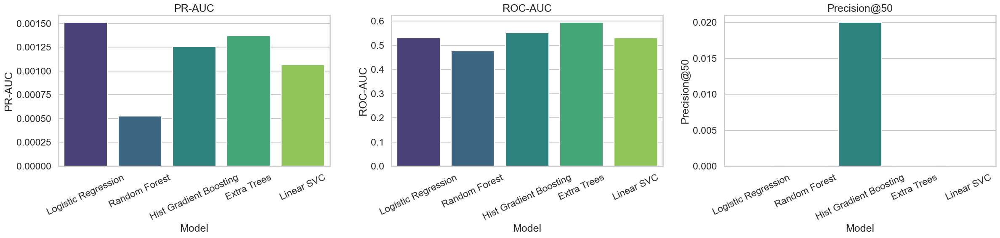
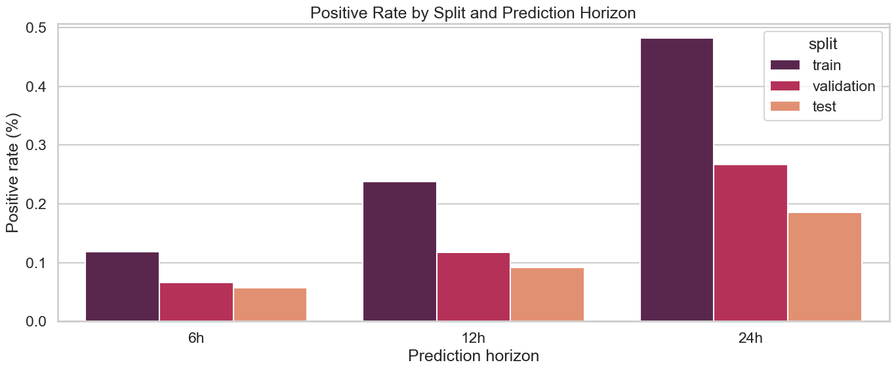
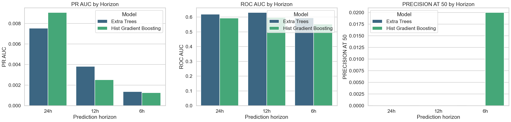
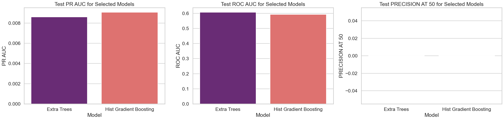
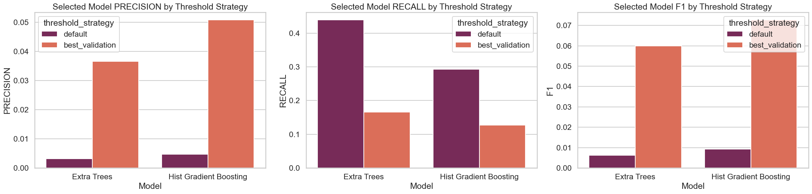

# HPC Failure Prediction Using Machine Learning

## Problem Addressed

High-performance computing (HPC) systems are made up of many nodes running large volumes of jobs. When individual nodes fail, the effects include interrupted workloads, wasted compute time, and reduced system reliability. The problem addressed in this project is whether node-level failures can be predicted early enough to support preventive action.

This repository frames the problem as a supervised learning task:

- given the recent workload and system-usage behavior of a node
- predict whether that node will fail within a future time horizon

The final formulation is a node-hour risk prediction problem.

## Dataset Used

### Failure dataset

Raw source:

- [LA-UR-05-7318-failure-data-1996-2005.csv](../data/raw/lanl_failure/LA-UR-05-7318-failure-data-1996-2005.csv)

This dataset contains:

- failure and interruption events
- system identifiers
- node identifiers
- event start and end timestamps
- failure categories

This dataset is the source of the target labels.

### Usage dataset

Raw sources:

- [LA-UR-06-0803-MX20_NODES_0_TO_255_NODE-Z.TXT](../data/raw/lanl_usage/LA-UR-06-0803-MX20_NODES_0_TO_255_NODE-Z.TXT)
- [LA-UR-06-0803-MX20_NODES_0_TO_255_NODE-Z.README](../data/raw/lanl_usage/LA-UR-06-0803-MX20_NODES_0_TO_255_NODE-Z.README)

This dataset contains:

- job end times
- user identifiers
- processor requests
- dispatch and submit timestamps
- CPU user and system times
- total CPU time
- job finish status
- node allocation lists

This dataset is the source of the predictive features.

### Why both datasets were necessary

The failure dataset alone provides event labels but very limited behavioral context. The usage dataset provides system workload patterns but does not directly indicate future failures. The project therefore combines:

- failure data for labels
- usage data for features

This is what turns the project into a genuine predictive modeling task rather than a simple event summary.

### Why the specific usage dataset was selected

The usage dataset is specific to:

- `System 20`
- nodes `0` to `255`

The failure dataset includes multiple systems, so the failure records had to be filtered to the same scope. The project used:

- `System == 20`
- `nodenumz` between `0` and `255`

The column `nodenumz` was chosen because the usage dataset uses zero-based node numbering. This is a critical alignment step.

## Methodology

### Step 1: Data exploration and raw parsing

Notebook:

- [01_data_exploration.ipynb](../notebooks/01_data_exploration.ipynb)

The first stage loaded both raw datasets and examined their structure. The failure CSV required `skiprows=1` to read the correct header structure. The usage file required custom parsing because its format is space-delimited with a variable-length tail containing node lists or node ranges.

Key actions:

- converted failure timestamps to datetimes
- filtered failure records to `System 20` and nodes `0..255`
- parsed job lines from the usage TXT file
- extracted trailing node information
- expanded ranges such as `129-139` into individual nodes
- created an exploded node-event usage table

Interim outputs written to [data/interim/](../data/interim/):

- [failure_system20_nodes_0_255.csv](../data/interim/failure_system20_nodes_0_255.csv)
- [usage_jobs_clean.csv.gz](../data/interim/usage_jobs_clean.csv.gz)
- [usage_node_events.csv.gz](../data/interim/usage_node_events.csv.gz)

### Step 2: Data cleaning

Notebook:

- [02_data_cleaning.ipynb](../notebooks/02_data_cleaning.ipynb)

The second stage cleaned the parsed failure and usage tables.

Usage data cleaning steps:

- standardized the `status` field to lowercase trimmed text
- converted numeric fields with invalid values coerced to missing
- removed invalid rows without `usage_time`
- restricted nodes to `0..255`
- removed duplicate usage rows
- created `queue_wait_seconds`
- set negative queue waits to missing
- created `cpu_time_per_proc`
- created `requested_procs_per_node`
- created `cpu_user_ratio`
- derived `hour`, `hour_of_day`, `day_of_week`, and `is_weekend`
- encoded job status buckets such as `finished`, `aborted`, and `failed`

Failure data cleaning steps:

- removed duplicate failure rows
- sorted failures chronologically
- created `failure_duration_minutes`
- clipped negative durations to `0`

Cleaned outputs written to [data/interim/](../data/interim/):

- [failure_system20_clean.csv](../data/interim/failure_system20_clean.csv)
- [usage_node_events_clean.csv.gz](../data/interim/usage_node_events_clean.csv.gz)

### Step 3: Feature engineering

Notebook:

- [03_feature_engineering.ipynb](../notebooks/03_feature_engineering.ipynb)

This stage produced the final processed dataset used for model training.

#### 3.1 Aggregation to node-hour level

The cleaned usage-node events were aggregated by:

- `node`
- `hour`

This produced one row per node-hour. The purpose was to create a common modeling grain that combines workload history and future failure labels.

Examples of engineered node-hour features:

- `job_count`
- `unique_users`
- `avg_requested_procs`
- `total_cpu_user_time`
- `total_cpu_system_time`
- `total_cpu_time`
- `avg_queue_wait_seconds`
- `aborted_jobs`
- `failed_jobs`

#### 3.2 Temporal features

To capture recent workload behavior, the notebook created:

- lag features such as `*_lag_1h`
- rolling window features such as `*_rolling_6h`

These features allow the model to use recent history rather than only the current hour.

#### 3.3 Ratio features

The notebook also created:

- `cpu_time_share_system`
- `aborted_job_ratio`
- `failed_job_ratio`

These are more stable than raw counts when workload levels vary significantly.

### Step 4: Horizon creation

The project supports several future-prediction windows. This was done by first computing:

- `next_failure_time`
- `hours_to_next_failure`

For each node-hour row, the next future failure for that node was found chronologically. Then four binary label columns were created:

- `label_next_1h`
- `label_next_6h`
- `label_next_12h`
- `label_next_24h`

Each label is set to `1` if the next failure happens within the specified number of hours from the current row, otherwise `0`.

This produced the main processed dataset:

- [node_hour_features_multi_horizon.csv.gz](../data/processed/node_hour_features_multi_horizon.csv.gz)

### Step 5: Model training setup

All modeling notebooks use the processed multi-horizon table.

Key design decisions:

- chronological split instead of random split
- `70%` train, `15%` validation, `15%` test by unique hour
- `node` retained as a feature
- leakage columns removed from model input

Removed from features:

- `hour`
- `next_failure_time`
- `hours_to_next_failure`
- all `label_next_*` columns

### Algorithms used

The following algorithms were trained and compared:

- Logistic Regression
- Random Forest
- Hist Gradient Boosting
- Extra Trees
- Linear SVC

Associated notebooks:

- [04_logistic_regression_baseline.ipynb](../notebooks/04_logistic_regression_baseline.ipynb)
- [05_random_forest.ipynb](../notebooks/05_random_forest.ipynb)
- [06_hist_gradient_boosting.ipynb](../notebooks/06_hist_gradient_boosting.ipynb)
- [07_extra_trees.ipynb](../notebooks/07_extra_trees.ipynb)
- [08_linear_svc.ipynb](../notebooks/08_linear_svc.ipynb)

### Evaluation metrics

Because the target class is highly imbalanced, raw accuracy is not the main metric. A naive classifier could obtain high accuracy simply by predicting no failures. The project therefore compares models mainly using:

- `PR-AUC`
- `ROC-AUC`
- precision
- recall
- `F1`
- `precision_at_50`

This is more appropriate for rare-event prediction.

## Results and Discussion

### Comparison at the 6-hour horizon

The first cross-model comparison was done in:

- [09_model_comparison.ipynb](../notebooks/09_model_comparison.ipynb)

Key outputs:

- [test_metric_overview.png](../results/model_comparison/test_metric_overview.png)
- [ranking_signal_comparison.png](../results/model_comparison/ranking_signal_comparison.png)
- [threshold_strategy_comparison.png](../results/model_comparison/threshold_strategy_comparison.png)
- [model_ranking.csv](../results/model_comparison/model_ranking.csv)

Default-threshold test comparison on `label_next_6h`:

| Model | PR-AUC | ROC-AUC |
| --- | ---: | ---: |
| Logistic Regression | 0.001510 | 0.531546 |
| Random Forest | 0.000526 | 0.477452 |
| Hist Gradient Boosting | 0.001257 | 0.552035 |
| Extra Trees | 0.001372 | 0.594920 |
| Linear SVC | 0.001066 | 0.531084 |

Discussion:

- Logistic Regression performed best on `PR-AUC` at `6h`.
- Extra Trees performed best on `ROC-AUC`.
- Random Forest performed worst.
- None of the `6h` models were strong enough to be treated as the final answer.



*Figure 1. Metric comparison across all models for the `6h` horizon.*

### Comparison across horizons

The next analysis checked whether a wider prediction horizon makes the task easier.

Notebook:

- [10_horizon_comparison.ipynb](../notebooks/10_horizon_comparison.ipynb)

Key outputs:

- [positive_rate_by_horizon.png](../results/horizon_comparison/positive_rate_by_horizon.png)
- [horizon_metric_overview.png](../results/horizon_comparison/horizon_metric_overview.png)
- [precision_recall_tradeoff_by_horizon.png](../results/horizon_comparison/precision_recall_tradeoff_by_horizon.png)
- [experiment_ranking.csv](../results/horizon_comparison/experiment_ranking.csv)

Selected default-threshold results:

| Model | Horizon | PR-AUC | ROC-AUC |
| --- | ---: | ---: | ---: |
| Extra Trees | 6h | 0.001372 | 0.594920 |
| Extra Trees | 12h | 0.003811 | 0.630818 |
| Extra Trees | 24h | 0.007528 | 0.619565 |
| Hist Gradient Boosting | 6h | 0.001257 | 0.552035 |
| Hist Gradient Boosting | 12h | 0.002519 | 0.596741 |
| Hist Gradient Boosting | 24h | 0.009062 | 0.593044 |

Discussion:

- Wider horizons produced more positive training examples.
- Both Extra Trees and Hist Gradient Boosting improved substantially as the horizon widened.
- The `24h` horizon provided the strongest overall predictive signal.



*Figure 2. Positive label rate grows as the prediction horizon widens.*



*Figure 3. Cross-horizon performance comparison.*

### Final model selection on the 24-hour horizon

The strongest `24h` candidates were tuned and finalized in:

- [11_model_finalization_24h.ipynb](../notebooks/11_model_finalization_24h.ipynb)

Key outputs:

- [validation_tuning_overview.png](../results/model_finalization_24h/validation_tuning_overview.png)
- [selected_model_test_metrics.png](../results/model_finalization_24h/selected_model_test_metrics.png)
- [selected_model_threshold_tradeoff.png](../results/model_finalization_24h/selected_model_threshold_tradeoff.png)
- [selected_models.csv](../results/model_finalization_24h/selected_models.csv)
- [selected_model_test_results.csv](../results/model_finalization_24h/selected_model_test_results.csv)

Final `24h` split balance:

| Split | Rows | Positives | Positive rate |
| --- | ---: | ---: | ---: |
| Train | 488,782 | 2,358 | 0.004824 |
| Validation | 114,395 | 305 | 0.002666 |
| Test | 84,637 | 157 | 0.001855 |

Selected test results:

| Model | Threshold strategy | PR-AUC | ROC-AUC | Precision | Recall | F1 |
| --- | --- | ---: | ---: | ---: | ---: | ---: |
| Extra Trees | default | 0.008593 | 0.606745 | 0.003157 | 0.439490 | 0.006270 |
| Extra Trees | best validation | 0.008593 | 0.606745 | 0.036620 | 0.165605 | 0.059977 |
| Hist Gradient Boosting | default | 0.009062 | 0.593044 | 0.004716 | 0.292994 | 0.009284 |
| Hist Gradient Boosting | best validation | 0.009062 | 0.593044 | 0.050891 | 0.127389 | 0.072727 |

Discussion:

- Extra Trees was stronger on `ROC-AUC` and recall.
- Hist Gradient Boosting was stronger on `PR-AUC`.
- Hist Gradient Boosting also achieved the best threshold-adjusted `F1`.
- For an imbalanced failure-prediction task, the Hist Gradient Boosting result is the better primary final model because precision-recall behavior is more important than raw separability alone.



*Figure 4. Default-threshold comparison of the final `24h` model families.*



*Figure 5. Effect of threshold tuning on the final `24h` candidates.*

## Comparison and Contrast of Algorithms

### Logistic Regression

Strengths:

- simple and interpretable
- useful as a baseline
- best `PR-AUC` among the `6h` models

Weaknesses:

- linear decision surface
- limited ability to capture non-linear workload interactions

### Random Forest

Strengths:

- can model non-linear relationships
- robust in many tabular tasks

Weaknesses:

- weakest model in this project
- did not improve on the linear baseline under this data setup

### Hist Gradient Boosting

Strengths:

- strong tabular learner
- best final `PR-AUC`
- best final threshold-adjusted `F1`
- best choice when precision-recall quality matters

Weaknesses:

- slightly weaker than Extra Trees on final `ROC-AUC`
- still limited by sparse positives

### Extra Trees

Strengths:

- best final `ROC-AUC`
- strong recall-oriented behavior
- strong alternative final model

Weaknesses:

- weaker than Hist Gradient Boosting on final `PR-AUC`
- threshold tuning was still required for better precision

### Linear SVC

Strengths:

- practical as a linear benchmark
- confirmed the general behavior seen from logistic regression

Weaknesses:

- did not meaningfully improve on logistic regression
- less naturally suited to calibrated probability outputs

## Limitations

The project has several real limitations.

- The class imbalance remains severe even at the `24h` horizon.
- The usage data only covers `System 20` and nodes `0..255`, so the study does not generalize to all LANL systems.
- The usage file required custom parsing, which introduces some structural assumptions.
- The modeling table is built from observed usage-node activity, not a fully dense node-hour grid for all nodes at all times.
- The models depend on historical workload patterns only; other hardware or environmental signals are not available in this repository.

## Future Work

The most useful extensions would be:

- build a fully dense node-hour grid so idle periods are modeled explicitly
- evaluate calibrated risk thresholds for operational alerting
- add more horizons or survival-style modeling for time-to-failure
- engineer richer temporal features beyond short lags and rolling windows
- test resampling or cost-sensitive training strategies for rare-event learning
- evaluate generalization across different systems if matching usage data becomes available

## Conclusion

This project combined LANL failure logs and usage logs to build a reproducible failure-prediction pipeline. The workflow selected the compatible subset of both datasets, cleaned and aligned them, aggregated usage behavior into node-hour features, and created multiple future-failure horizons. Model comparison showed that the short `6h` task was too sparse to learn well, while the `24h` horizon produced substantially stronger results. Among the evaluated models, Hist Gradient Boosting on `label_next_24h` is the best final model when judged by precision-recall quality, while Extra Trees remains a strong recall-oriented benchmark.


# Appendix: Source Code

This appendix contains the notebook source code as plain text. It is intended to satisfy the submission requirement that the source code must appear in the report appendix as text rather than screenshots.


## 01_data_exploration.ipynb

Source file: [01_data_exploration.ipynb](../notebooks/01_data_exploration.ipynb)


### Code Cell 1

```python
from pathlib import Path

import numpy as np
import pandas as pd
import seaborn as sns
import matplotlib.pyplot as plt
from IPython.display import display

pd.set_option('display.max_columns', 50)
pd.set_option('display.width', 160)
sns.set_theme(style='whitegrid', context='talk')
plt.rcParams['figure.figsize'] = (14, 6)
```

### Code Cell 2

```python
PROJECT_NAME = 'IT4060-ML-Assignment-HPC-Failure-Prediction'
FAILURE_FILE = 'LA-UR-05-7318-failure-data-1996-2005.csv'
USAGE_FILE = 'LA-UR-06-0803-MX20_NODES_0_TO_255_NODE-Z.TXT'
BASE_USAGE_COLUMNS = [
    'job_end_time', 'user_id', 'num_procs', 'submit_time', 'suggested_time',
    'deadline_time', 'dispatch_time', 'cpu_user_time', 'cpu_system_time',
    'total_time', 'batch_id'
]

def find_project_root():
    cwd = Path.cwd().resolve()
    home = Path.home().resolve()
    desktop = home / 'Desktop'
    candidate_roots = [cwd, *cwd.parents, home, desktop, desktop / 'Manilka' / 'ML_Assignment']
    seen = set()

    for base in candidate_roots:
        for candidate in (base, base / PROJECT_NAME):
            if candidate in seen or not candidate.exists():
                continue
            seen.add(candidate)

            failure_path = candidate / 'data' / 'raw' / 'lanl_failure' / FAILURE_FILE
            usage_path = candidate / 'data' / 'raw' / 'lanl_usage' / USAGE_FILE
            if failure_path.exists() and usage_path.exists():
                return candidate

    for search_root in (desktop, home):
        if not search_root.exists():
            continue
        for match in search_root.rglob(FAILURE_FILE):
            candidate = match.parents[3]
            usage_path = candidate / 'data' / 'raw' / 'lanl_usage' / USAGE_FILE
            if usage_path.exists():
                return candidate

    raise FileNotFoundError('Could not locate the project data directory.')

def parse_usage_line(line):
    parts = line.strip().split(maxsplit=12)
    if len(parts) < 11:
        return None

    row = dict(zip(BASE_USAGE_COLUMNS, parts[:11]))
    row['status'] = parts[11] if len(parts) >= 12 else None
    row['nodes_raw'] = parts[12] if len(parts) == 13 else None
    return row

def extract_nodes(nodes_raw):
    if not isinstance(nodes_raw, str):
        return []

    cleaned = nodes_raw.replace('/', ' ').strip()
    if not cleaned:
        return []

    nodes = []
    for token in cleaned.split():
        if '-' in token:
            start, end = token.split('-', 1)
            nodes.extend(range(int(start), int(end) + 1))
        else:
            nodes.append(int(token))
    return sorted(set(nodes))

def first_non_null_label(row, columns):
    for column in columns:
        value = row[column]
        if pd.notna(value):
            return column
    return 'Unknown'

project_root = find_project_root()
failure_path = project_root / 'data' / 'raw' / 'lanl_failure' / FAILURE_FILE
usage_path = project_root / 'data' / 'raw' / 'lanl_usage' / USAGE_FILE
interim_dir = project_root / 'data' / 'interim'
interim_dir.mkdir(parents=True, exist_ok=True)

print(f'Working directory: {Path.cwd()}')
print(f'Project root: {project_root}')
print(f'Failure data path: {failure_path}')
print(f'Usage data path: {usage_path}')
print(f'Interim data path: {interim_dir}')
```

### Code Cell 3

```python
failure_df = pd.read_csv(failure_path, skiprows=1).rename(columns={
    'Prob Started (mm/dd/yy hh:mm)': 'failure_start',
    'Prob Fixed (mm/dd/yy hh:mm)': 'failure_end',
})
failure_df['failure_start'] = pd.to_datetime(failure_df['failure_start'], errors='coerce')
failure_df['failure_end'] = pd.to_datetime(failure_df['failure_end'], errors='coerce')
failure_df['failure_category'] = failure_df.apply(
    first_non_null_label,
    axis=1,
    columns=['Facilities', 'Hardware', 'Human Error', 'Network', 'Undetermined', 'Software'],
)

usage_rows = []
skipped_short_lines = 0
with usage_path.open() as f:
    for line_number, line in enumerate(f, start=1):
        parsed = parse_usage_line(line)
        if parsed is None:
            skipped_short_lines += 1
            continue
        parsed['line_number'] = line_number
        usage_rows.append(parsed)

usage_df = pd.DataFrame(usage_rows)
for column in BASE_USAGE_COLUMNS:
    usage_df[column] = pd.to_numeric(usage_df[column], errors='coerce')

usage_df['status'] = usage_df['status'].astype('string').str.strip()
usage_df['usage_time'] = pd.to_datetime(usage_df['job_end_time'], unit='s', errors='coerce')
usage_df['submit_time'] = pd.to_datetime(usage_df['submit_time'], unit='s', errors='coerce')
usage_df['dispatch_time'] = pd.to_datetime(usage_df['dispatch_time'], unit='s', errors='coerce')
usage_df['nodes'] = usage_df['nodes_raw'].apply(extract_nodes)
usage_df['node_count'] = usage_df['nodes'].str.len()
usage_df['has_node_info'] = usage_df['node_count'].gt(0)

usage_df = usage_df.loc[
    usage_df['usage_time'].notna() &
    (usage_df['job_end_time'] >= 1_000_000_000) &
    usage_df['batch_id'].notna()
].copy()

failure_system20 = failure_df.loc[
    (failure_df['System'] == 20) &
    (failure_df['nodenumz'].between(0, 255, inclusive='both')) &
    failure_df['failure_start'].notna()
].copy()
failure_system20['nodenumz'] = failure_system20['nodenumz'].astype(int)

usage_with_nodes = usage_df.loc[usage_df['has_node_info']].explode('nodes').rename(columns={'nodes': 'node'}).copy()
usage_with_nodes['node'] = usage_with_nodes['node'].astype(int)
usage_with_nodes = usage_with_nodes.loc[usage_with_nodes['node'].between(0, 255)].copy()

overview = pd.DataFrame([
    {
        'dataset': 'failure',
        'rows': len(failure_df),
        'columns': failure_df.shape[1],
        'start_time': failure_df['failure_start'].min(),
        'end_time': failure_df['failure_end'].max(),
    },
    {
        'dataset': 'usage',
        'rows': len(usage_df),
        'columns': usage_df.shape[1],
        'start_time': usage_df['usage_time'].min(),
        'end_time': usage_df['usage_time'].max(),
    },
])

display(overview)
print(f'Skipped malformed short usage lines: {skipped_short_lines:,}')
```

### Code Cell 4

```python
failure_export_path = interim_dir / 'failure_system20_nodes_0_255.csv'
usage_jobs_export_path = interim_dir / 'usage_jobs_clean.csv.gz'
usage_nodes_export_path = interim_dir / 'usage_node_events.csv.gz'

failure_export = failure_system20.sort_values(['failure_start', 'nodenumz']).copy()
usage_jobs_export = usage_df.sort_values(['usage_time', 'batch_id']).copy()
usage_jobs_export['nodes'] = usage_jobs_export['nodes'].apply(lambda values: ' '.join(map(str, values)) if values else '')
usage_nodes_export = usage_with_nodes.sort_values(['usage_time', 'node', 'batch_id']).copy()

failure_export.to_csv(failure_export_path, index=False)
usage_jobs_export.to_csv(usage_jobs_export_path, index=False, compression='gzip')
usage_nodes_export.to_csv(usage_nodes_export_path, index=False, compression='gzip')

interim_manifest = pd.DataFrame([
    {'file_name': failure_export_path.name, 'rows': len(failure_export), 'description': 'System 20 failure records filtered to nodes 0-255'},
    {'file_name': usage_jobs_export_path.name, 'rows': len(usage_jobs_export), 'description': 'Cleaned usage job records with parsed timestamps'},
    {'file_name': usage_nodes_export_path.name, 'rows': len(usage_nodes_export), 'description': 'Usage job records exploded to one row per node'},
])

display(interim_manifest)
print('Interim files written successfully.')
```

### Code Cell 5

```python
failure_summary = pd.DataFrame([
    {'metric': 'Total failure records', 'value': len(failure_df)},
    {'metric': 'Unique systems', 'value': failure_df['System'].nunique()},
    {'metric': 'Unique nodes in System 20 (0-255)', 'value': failure_system20['nodenumz'].nunique()},
    {'metric': 'System 20 failure rows on nodes 0-255', 'value': len(failure_system20)},
    {'metric': 'Failure time range start', 'value': failure_df['failure_start'].min()},
    {'metric': 'Failure time range end', 'value': failure_df['failure_end'].max()},
])

display(failure_summary)
display(failure_df[['System', 'machine type', 'nodenum', 'nodenumz', 'failure_start', 'failure_end', 'failure_category', 'Same Event']].head())

failure_missing = failure_df[['Facilities', 'Hardware', 'Human Error', 'Network', 'Undetermined', 'Software']].isna().mean().sort_values(ascending=False).rename('missing_ratio')
display(failure_missing.to_frame())
```

### Code Cell 6

```python
top_systems = failure_df['System'].value_counts().head(10).sort_values(ascending=False).rename_axis('System').reset_index(name='failure_count')
category_counts = failure_df['failure_category'].value_counts().head(10).rename_axis('failure_category').reset_index(name='failure_count')
failure_year_counts = failure_df.dropna(subset=['failure_start']).assign(year=failure_df['failure_start'].dt.year).groupby('year').size().reset_index(name='failure_count')
system20_top_nodes = failure_system20['nodenumz'].value_counts().head(15).sort_values(ascending=False).rename_axis('node').reset_index(name='failure_count')

fig, axes = plt.subplots(2, 2, figsize=(18, 12))
sns.barplot(data=top_systems, x='failure_count', y='System', hue='System', dodge=False, legend=False, ax=axes[0, 0], palette='Blues_r')
axes[0, 0].set_title('Top Systems by Failure Count')
axes[0, 0].set_xlabel('Failure records')
axes[0, 0].set_ylabel('System')

sns.barplot(data=category_counts, x='failure_count', y='failure_category', hue='failure_category', dodge=False, legend=False, ax=axes[0, 1], palette='rocket')
axes[0, 1].set_title('Failure Categories')
axes[0, 1].set_xlabel('Failure records')
axes[0, 1].set_ylabel('Category source column')

sns.lineplot(data=failure_year_counts, x='year', y='failure_count', marker='o', ax=axes[1, 0], color='teal')
axes[1, 0].set_title('Failure Records by Year')
axes[1, 0].set_xlabel('Year')
axes[1, 0].set_ylabel('Failure records')

sns.barplot(data=system20_top_nodes, x='failure_count', y='node', hue='node', dodge=False, legend=False, ax=axes[1, 1], palette='viridis')
axes[1, 1].set_title('Most Failure-Prone Nodes in System 20 (0-255)')
axes[1, 1].set_xlabel('Failure records')
axes[1, 1].set_ylabel('Node')

plt.tight_layout()
plt.show()
```

### Code Cell 7

```python
usage_summary = pd.DataFrame([
    {'metric': 'Parsed usage records', 'value': len(usage_df)},
    {'metric': 'Rows with explicit node info', 'value': int(usage_df['has_node_info'].sum())},
    {'metric': 'Unique users', 'value': usage_df['user_id'].nunique()},
    {'metric': 'Unique batch IDs', 'value': usage_df['batch_id'].nunique()},
    {'metric': 'Usage time range start', 'value': usage_df['usage_time'].min()},
    {'metric': 'Usage time range end', 'value': usage_df['usage_time'].max()},
])

display(usage_summary)
display(usage_df[['usage_time', 'user_id', 'num_procs', 'cpu_user_time', 'cpu_system_time', 'total_time', 'status', 'nodes_raw', 'node_count']].head())

usage_status_counts = usage_df['status'].fillna('missing').value_counts().rename_axis('status').reset_index(name='count')
display(usage_status_counts)

usage_numeric_summary = usage_df[['num_procs', 'cpu_user_time', 'cpu_system_time', 'total_time', 'node_count']].describe().T
display(usage_numeric_summary)
```

### Code Cell 8

```python
status_counts = usage_df['status'].fillna('missing').value_counts().rename_axis('status').reset_index(name='count')
top_proc_requests = usage_df['num_procs'].value_counts().head(15).rename_axis('num_procs').reset_index(name='job_count')
monthly_usage_jobs = usage_df.set_index('usage_time').resample('ME').size().reset_index(name='job_count')
usage_duration_sample = usage_df.loc[usage_df['total_time'] > 0, 'total_time']
usage_duration_sample = usage_duration_sample.sample(min(20000, len(usage_duration_sample)), random_state=42)
usage_duration_plot = pd.DataFrame({'log10_total_time': np.log10(usage_duration_sample)})
node_count_distribution = usage_df.loc[usage_df['has_node_info'], 'node_count'].clip(upper=64)

fig, axes = plt.subplots(2, 2, figsize=(18, 12))
sns.barplot(data=status_counts, x='count', y='status', hue='status', dodge=False, legend=False, ax=axes[0, 0], palette='mako')
axes[0, 0].set_title('Usage Job Status Distribution')
axes[0, 0].set_xlabel('Jobs')
axes[0, 0].set_ylabel('Status')

sns.barplot(data=top_proc_requests, x='num_procs', y='job_count', hue='num_procs', dodge=False, legend=False, ax=axes[0, 1], palette='crest')
axes[0, 1].set_title('Most Common Requested Processor Counts')
axes[0, 1].set_xlabel('Requested processors')
axes[0, 1].set_ylabel('Jobs')

sns.lineplot(data=monthly_usage_jobs, x='usage_time', y='job_count', ax=axes[1, 0], color='darkorange')
axes[1, 0].set_title('Monthly Usage Job Volume')
axes[1, 0].set_xlabel('Month')
axes[1, 0].set_ylabel('Jobs')

sns.histplot(data=usage_duration_plot, x='log10_total_time', bins=40, ax=axes[1, 1], color='slateblue')
axes[1, 1].set_title('Distribution of Job Duration Proxy')
axes[1, 1].set_xlabel('log10(total_time)')
axes[1, 1].set_ylabel('Jobs')

plt.tight_layout()
plt.show()

plt.figure(figsize=(12, 5))
sns.histplot(node_count_distribution, bins=30, color='seagreen')
plt.title('Node Count per Job for Rows With Node Information')
plt.xlabel('Number of nodes referenced in the job record')
plt.ylabel('Jobs')
plt.tight_layout()
plt.show()
```

### Code Cell 9

```python
usage_min = usage_df['usage_time'].min()
usage_max = usage_df['usage_time'].max()

failure_overlap = failure_system20.loc[
    failure_system20['failure_start'].between(usage_min, usage_max, inclusive='both')
].copy()

overlap_summary = pd.DataFrame([
    {'metric': 'System 20 failure rows on nodes 0-255', 'value': len(failure_system20)},
    {'metric': 'Failures inside usage time window', 'value': len(failure_overlap)},
    {'metric': 'Unique failure nodes in overlap window', 'value': failure_overlap['nodenumz'].nunique()},
    {'metric': 'Unique usage nodes with node info', 'value': usage_with_nodes['node'].nunique()},
    {'metric': 'First usage timestamp', 'value': usage_min},
    {'metric': 'Last usage timestamp', 'value': usage_max},
])

display(overlap_summary)

monthly_failure_overlap = failure_overlap.set_index('failure_start').resample('ME').size().rename('failures')
monthly_usage_overlap = usage_df.loc[usage_df['has_node_info']].set_index('usage_time').resample('ME').size().rename('usage_jobs')
trend_compare = pd.concat([monthly_failure_overlap, monthly_usage_overlap], axis=1).fillna(0)
trend_compare['failure_index'] = trend_compare['failures'] / trend_compare['failures'].max()
trend_compare['usage_index'] = trend_compare['usage_jobs'] / trend_compare['usage_jobs'].max()
trend_plot = trend_compare[['failure_index', 'usage_index']].reset_index().melt(id_vars='index', var_name='series', value_name='scaled_count')
trend_plot = trend_plot.rename(columns={'index': 'month'})

plt.figure(figsize=(14, 6))
sns.lineplot(data=trend_plot, x='month', y='scaled_count', hue='series', marker='o')
plt.title('Normalized Monthly Trend: Failure Events vs Usage Jobs')
plt.xlabel('Month')
plt.ylabel('Scaled count')
plt.tight_layout()
plt.show()
```

## 02_data_cleaning.ipynb

Source file: [02_data_cleaning.ipynb](../notebooks/02_data_cleaning.ipynb)


### Code Cell 1

```python
from pathlib import Path

import numpy as np
import pandas as pd
from IPython.display import display

pd.set_option('display.max_columns', 60)
pd.set_option('display.width', 180)
```

### Code Cell 2

```python
PROJECT_NAME = 'IT4060-ML-Assignment-HPC-Failure-Prediction'

def find_project_root():
    cwd = Path.cwd().resolve()
    home = Path.home().resolve()
    desktop = home / 'Desktop'
    candidate_roots = [cwd, *cwd.parents, home, desktop, desktop / 'Manilka' / 'ML_Assignment']
    seen = set()

    for base in candidate_roots:
        for candidate in (base, base / PROJECT_NAME):
            if candidate in seen or not candidate.exists():
                continue
            seen.add(candidate)
            if (candidate / 'data' / 'interim').exists():
                return candidate

    raise FileNotFoundError('Could not locate the project root with data/interim.')

project_root = find_project_root()
interim_dir = project_root / 'data' / 'interim'

failure_interim_path = interim_dir / 'failure_system20_nodes_0_255.csv'
usage_nodes_interim_path = interim_dir / 'usage_node_events.csv.gz'

failure_clean_path = interim_dir / 'failure_system20_clean.csv'
usage_nodes_clean_path = interim_dir / 'usage_node_events_clean.csv.gz'

required_files = [failure_interim_path, usage_nodes_interim_path]
missing_files = [path.name for path in required_files if not path.exists()]
if missing_files:
    raise FileNotFoundError(
        'Missing interim files: ' + ', '.join(missing_files) + '. Run 01_data_exploration.ipynb first.'
    )

print(f'Working directory: {Path.cwd()}')
print(f'Project root: {project_root}')
print(f'Interim directory: {interim_dir}')
```

### Code Cell 3

```python
failure_df = pd.read_csv(
    failure_interim_path,
    parse_dates=['failure_start', 'failure_end'],
    low_memory=False,
)

usage_nodes_df = pd.read_csv(
    usage_nodes_interim_path,
    parse_dates=['usage_time', 'submit_time', 'dispatch_time'],
    low_memory=False,
)

overview = pd.DataFrame([
    {'dataset': 'failure_interim', 'rows': len(failure_df), 'columns': failure_df.shape[1]},
    {'dataset': 'usage_node_events_interim', 'rows': len(usage_nodes_df), 'columns': usage_nodes_df.shape[1]},
])

display(overview)
display(failure_df.head())
display(usage_nodes_df[['usage_time', 'node', 'user_id', 'num_procs', 'total_time', 'status']].head())
```

### Code Cell 4

```python
usage_nodes_df['status'] = usage_nodes_df['status'].fillna('missing').astype('string').str.strip().str.lower()

numeric_columns = [
    'user_id', 'num_procs', 'cpu_user_time', 'cpu_system_time', 'total_time',
    'batch_id', 'line_number', 'node', 'node_count'
]
for column in numeric_columns:
    if column in usage_nodes_df.columns:
        usage_nodes_df[column] = pd.to_numeric(usage_nodes_df[column], errors='coerce')

usage_nodes_df = usage_nodes_df.loc[
    usage_nodes_df['usage_time'].notna() &
    usage_nodes_df['node'].between(0, 255, inclusive='both') &
    usage_nodes_df['batch_id'].notna()
].copy()

usage_nodes_df['queue_wait_seconds'] = (
    usage_nodes_df['dispatch_time'] - usage_nodes_df['submit_time']
).dt.total_seconds()
usage_nodes_df.loc[usage_nodes_df['queue_wait_seconds'] < 0, 'queue_wait_seconds'] = np.nan

usage_nodes_df['cpu_time_per_proc'] = np.where(
    usage_nodes_df['num_procs'] > 0,
    usage_nodes_df['total_time'] / usage_nodes_df['num_procs'],
    np.nan,
)
usage_nodes_df['requested_procs_per_node'] = np.where(
    usage_nodes_df['node_count'] > 0,
    usage_nodes_df['num_procs'] / usage_nodes_df['node_count'],
    np.nan,
)
usage_nodes_df['cpu_user_ratio'] = np.where(
    usage_nodes_df['total_time'] > 0,
    usage_nodes_df['cpu_user_time'] / usage_nodes_df['total_time'],
    np.nan,
)

usage_nodes_df['hour'] = usage_nodes_df['usage_time'].dt.floor('h')
usage_nodes_df['hour_of_day'] = usage_nodes_df['usage_time'].dt.hour
usage_nodes_df['day_of_week'] = usage_nodes_df['usage_time'].dt.dayofweek
usage_nodes_df['is_weekend'] = usage_nodes_df['day_of_week'].isin([5, 6]).astype(int)

status_buckets = ['finished', 'aborted', 'failed', 'killed', 'syskill', 'missing']
for status in status_buckets:
    usage_nodes_df[f'status_{status}'] = (usage_nodes_df['status'] == status).astype(int)
usage_nodes_df['status_other'] = (~usage_nodes_df['status'].isin(status_buckets)).astype(int)

duplicate_usage_rows = usage_nodes_df.duplicated(subset=['batch_id', 'node', 'usage_time', 'line_number']).sum()
usage_nodes_df = usage_nodes_df.drop_duplicates(subset=['batch_id', 'node', 'usage_time', 'line_number']).copy()

duplicate_failure_rows = failure_df.duplicated(subset=['nodenumz', 'failure_start', 'failure_end', 'Hardware', 'Software', 'Undetermined']).sum()
failure_df = failure_df.drop_duplicates(subset=['nodenumz', 'failure_start', 'failure_end', 'Hardware', 'Software', 'Undetermined']).copy()

failure_df['failure_duration_minutes'] = (
    failure_df['failure_end'] - failure_df['failure_start']
).dt.total_seconds() / 60
failure_df['failure_duration_minutes'] = failure_df['failure_duration_minutes'].clip(lower=0)

cleaning_summary = pd.DataFrame([
    {'metric': 'Duplicate usage-node rows removed', 'value': int(duplicate_usage_rows)},
    {'metric': 'Duplicate failure rows removed', 'value': int(duplicate_failure_rows)},
    {'metric': 'Clean usage-node rows', 'value': len(usage_nodes_df)},
    {'metric': 'Clean failure rows', 'value': len(failure_df)},
    {'metric': 'Usage rows with missing queue wait', 'value': int(usage_nodes_df['queue_wait_seconds'].isna().sum())},
])

missing_summary = usage_nodes_df[
    ['queue_wait_seconds', 'cpu_time_per_proc', 'requested_procs_per_node', 'cpu_user_ratio']
].isna().mean().rename('missing_ratio').to_frame()

display(cleaning_summary)
display(missing_summary)
display(usage_nodes_df[['usage_time', 'node', 'queue_wait_seconds', 'cpu_time_per_proc', 'requested_procs_per_node', 'cpu_user_ratio']].head())
```

### Code Cell 5

```python
failure_df = failure_df.sort_values(['failure_start', 'nodenumz']).copy()
usage_nodes_df = usage_nodes_df.sort_values(['usage_time', 'node', 'batch_id']).copy()

failure_df.to_csv(failure_clean_path, index=False)
usage_nodes_df.to_csv(usage_nodes_clean_path, index=False, compression='gzip')

export_summary = pd.DataFrame([
    {'file_name': failure_clean_path.name, 'rows': len(failure_df), 'description': 'Cleaned System 20 failure records'},
    {'file_name': usage_nodes_clean_path.name, 'rows': len(usage_nodes_df), 'description': 'Cleaned usage node-event rows with derived cleaning fields'},
])

display(export_summary)
print('Cleaned interim files written successfully.')
```

## 03_feature_engineering.ipynb

Source file: [03_feature_engineering.ipynb](../notebooks/03_feature_engineering.ipynb)


### Code Cell 1

```python
from pathlib import Path

import numpy as np
import pandas as pd
from IPython.display import display

pd.set_option('display.max_columns', 80)
pd.set_option('display.width', 200)
```

### Code Cell 2

```python
PROJECT_NAME = 'IT4060-ML-Assignment-HPC-Failure-Prediction'

def find_project_root():
    cwd = Path.cwd().resolve()
    home = Path.home().resolve()
    desktop = home / 'Desktop'
    candidate_roots = [cwd, *cwd.parents, home, desktop, desktop / 'Manilka' / 'ML_Assignment']
    seen = set()

    for base in candidate_roots:
        for candidate in (base, base / PROJECT_NAME):
            if candidate in seen or not candidate.exists():
                continue
            seen.add(candidate)
            if (candidate / 'data' / 'interim').exists():
                return candidate

    raise FileNotFoundError('Could not locate the project root with data/interim.')

project_root = find_project_root()
interim_dir = project_root / 'data' / 'interim'
processed_dir = project_root / 'data' / 'processed'
processed_dir.mkdir(parents=True, exist_ok=True)

failure_clean_path = interim_dir / 'failure_system20_clean.csv'
usage_nodes_clean_path = interim_dir / 'usage_node_events_clean.csv.gz'
feature_export_path = processed_dir / 'node_hour_features_multi_horizon.csv.gz'

required_files = [failure_clean_path, usage_nodes_clean_path]
missing_files = [path.name for path in required_files if not path.exists()]
if missing_files:
    raise FileNotFoundError(
        'Missing cleaned interim files: ' + ', '.join(missing_files) + '. Run 02_data_cleaning.ipynb first.'
    )

print(f'Working directory: {Path.cwd()}')
print(f'Project root: {project_root}')
print(f'Interim directory: {interim_dir}')
print(f'Processed directory: {processed_dir}')
```

### Code Cell 3

```python
failure_df = pd.read_csv(
    failure_clean_path,
    parse_dates=['failure_start', 'failure_end'],
    low_memory=False,
)

usage_nodes_df = pd.read_csv(
    usage_nodes_clean_path,
    parse_dates=['usage_time', 'submit_time', 'dispatch_time', 'hour'],
    low_memory=False,
)

overview = pd.DataFrame([
    {'dataset': 'failure_clean', 'rows': len(failure_df), 'columns': failure_df.shape[1]},
    {'dataset': 'usage_node_events_clean', 'rows': len(usage_nodes_df), 'columns': usage_nodes_df.shape[1]},
])

display(overview)
display(usage_nodes_df[['usage_time', 'hour', 'node', 'batch_id', 'queue_wait_seconds', 'cpu_time_per_proc', 'status']].head())
```

### Code Cell 4

```python
node_hour_features = usage_nodes_df.groupby(['node', 'hour'], as_index=False).agg(
    job_count=('batch_id', 'nunique'),
    unique_users=('user_id', 'nunique'),
    total_cpu_user_time=('cpu_user_time', 'sum'),
    total_cpu_system_time=('cpu_system_time', 'sum'),
    total_cpu_time=('total_time', 'sum'),
    avg_cpu_time_per_proc=('cpu_time_per_proc', 'mean'),
    avg_requested_procs=('num_procs', 'mean'),
    max_requested_procs=('num_procs', 'max'),
    avg_requested_procs_per_node=('requested_procs_per_node', 'mean'),
    avg_queue_wait_seconds=('queue_wait_seconds', 'mean'),
    median_queue_wait_seconds=('queue_wait_seconds', 'median'),
    avg_cpu_user_ratio=('cpu_user_ratio', 'mean'),
    weekend_jobs=('is_weekend', 'sum'),
    finished_jobs=('status_finished', 'sum'),
    aborted_jobs=('status_aborted', 'sum'),
    failed_jobs=('status_failed', 'sum'),
    killed_jobs=('status_killed', 'sum'),
    syskill_jobs=('status_syskill', 'sum'),
    missing_status_jobs=('status_missing', 'sum'),
    other_status_jobs=('status_other', 'sum'),
    dominant_hour_of_day=('hour_of_day', 'median'),
    dominant_day_of_week=('day_of_week', 'median'),
)

node_hour_features = node_hour_features.sort_values(['node', 'hour']).reset_index(drop=True)

lag_columns = ['job_count', 'unique_users', 'total_cpu_time', 'avg_queue_wait_seconds']
for column in lag_columns:
    node_hour_features[f'{column}_lag_1h'] = node_hour_features.groupby('node')[column].shift(1)
    node_hour_features[f'{column}_rolling_6h'] = (
        node_hour_features.groupby('node')[column]
        .transform(lambda values: values.shift(1).rolling(6, min_periods=1).mean())
    )

node_hour_features['cpu_time_share_system'] = np.where(
    node_hour_features['total_cpu_time'] > 0,
    node_hour_features['total_cpu_system_time'] / node_hour_features['total_cpu_time'],
    np.nan,
)
node_hour_features['aborted_job_ratio'] = np.where(
    node_hour_features['job_count'] > 0,
    node_hour_features['aborted_jobs'] / node_hour_features['job_count'],
    0,
)
node_hour_features['failed_job_ratio'] = np.where(
    node_hour_features['job_count'] > 0,
    node_hour_features['failed_jobs'] / node_hour_features['job_count'],
    0,
)

feature_summary = pd.DataFrame([
    {'metric': 'Node-hour rows before labeling', 'value': len(node_hour_features)},
    {'metric': 'Unique nodes', 'value': node_hour_features['node'].nunique()},
    {'metric': 'First hour', 'value': node_hour_features['hour'].min()},
    {'metric': 'Last hour', 'value': node_hour_features['hour'].max()},
])

display(feature_summary)
display(node_hour_features.head())
```

### Code Cell 5

```python
HORIZONS_HOURS = [1, 6, 12, 24]

failure_events = failure_df[['nodenumz', 'failure_start']].dropna().copy()
failure_events = failure_events.rename(columns={'nodenumz': 'node', 'failure_start': 'failure_time'})
failure_events['node'] = failure_events['node'].astype(int)
failure_events = failure_events.sort_values(['node', 'failure_time'])

failure_time_map = {
    node: group['failure_time'].to_numpy(dtype='datetime64[ns]')
    for node, group in failure_events.groupby('node')
}

def attach_next_failure(group):
    group = group.sort_values('hour').copy()
    node = int(group['node'].iloc[0])
    failure_times = failure_time_map.get(node)
    if failure_times is None or len(failure_times) == 0:
        group['next_failure_time'] = pd.NaT
        group['hours_to_next_failure'] = np.nan
        for horizon in HORIZONS_HOURS:
            group[f'label_next_{horizon}h'] = 0
        return group

    hour_values = group['hour'].to_numpy(dtype='datetime64[ns]')
    positions = np.searchsorted(failure_times, hour_values, side='right')
    next_failure_values = np.full(len(group), np.datetime64('NaT', 'ns'))
    valid_positions = positions < len(failure_times)
    next_failure_values[valid_positions] = failure_times[positions[valid_positions]]

    group['next_failure_time'] = pd.to_datetime(next_failure_values)
    group['hours_to_next_failure'] = (
        group['next_failure_time'] - group['hour']
    ).dt.total_seconds() / 3600
    for horizon in HORIZONS_HOURS:
        group[f'label_next_{horizon}h'] = (
            group['hours_to_next_failure'].between(0, horizon, inclusive='both').fillna(False).astype(int)
        )
    return group

labeled_groups = []
for node, group in node_hour_features.groupby('node', sort=False):
    group = group.copy()
    group['node'] = node
    labeled_groups.append(attach_next_failure(group))

model_df = pd.concat(labeled_groups, ignore_index=True)

label_summary_rows = [
    {'metric': 'Node-hour rows', 'value': len(model_df)},
    {'metric': 'Rows with known next failure time', 'value': int(model_df['next_failure_time'].notna().sum())},
]
for horizon in HORIZONS_HOURS:
    label_summary_rows.append(
        {'metric': f'Positive labels in next {horizon} hours', 'value': int(model_df[f'label_next_{horizon}h'].sum())}
    )
label_summary = pd.DataFrame(label_summary_rows)

display(label_summary)
display(model_df[['node', 'hour', 'next_failure_time', 'hours_to_next_failure', 'label_next_1h', 'label_next_6h', 'label_next_12h', 'label_next_24h']].head())
```

### Code Cell 6

```python
model_df.to_csv(feature_export_path, index=False, compression='gzip')

export_summary = pd.DataFrame([
    {'file_name': feature_export_path.name, 'rows': len(model_df), 'description': 'Processed node-hour feature table with multi-horizon failure labels'},
])

display(export_summary)
print(f'Processed feature table saved to: {feature_export_path}')
```

## 04_logistic_regression_baseline.ipynb

Source file: [04_logistic_regression_baseline.ipynb](../notebooks/04_logistic_regression_baseline.ipynb)


### Code Cell 1

```python
from pathlib import Path

import matplotlib.pyplot as plt
import numpy as np
import pandas as pd
import seaborn as sns
from IPython.display import display
from sklearn.compose import ColumnTransformer
from sklearn.impute import SimpleImputer
from sklearn.linear_model import LogisticRegression
from sklearn.metrics import average_precision_score, confusion_matrix, f1_score, precision_recall_curve, precision_score, recall_score, roc_auc_score, roc_curve
from sklearn.pipeline import Pipeline
from sklearn.preprocessing import OneHotEncoder, StandardScaler

pd.set_option('display.max_columns', 100)
pd.set_option('display.width', 220)
sns.set_theme(style='whitegrid', context='talk')
plt.rcParams['figure.figsize'] = (14, 6)
```

### Code Cell 2

```python
PROJECT_NAME = 'IT4060-ML-Assignment-HPC-Failure-Prediction'
TARGET_COLUMN = 'label_next_6h'
TRAIN_RATIO = 0.70
VALID_RATIO = 0.15
TEST_RATIO = 0.15
RANDOM_STATE = 42
MAX_ITER = 300
MODEL_VERBOSE = 1
RESULTS_MODEL_NAME = 'logistic_regression_baseline'

def find_project_root():
    cwd = Path.cwd().resolve()
    home = Path.home().resolve()
    desktop = home / 'Desktop'
    candidate_roots = [cwd, *cwd.parents, home, desktop, desktop / 'Manilka' / 'ML_Assignment']
    seen = set()

    for base in candidate_roots:
        for candidate in (base, base / PROJECT_NAME):
            if candidate in seen or not candidate.exists():
                continue
            seen.add(candidate)
            if (candidate / 'data' / 'processed').exists():
                return candidate

    raise FileNotFoundError('Could not locate the project root with data/processed.')

project_root = find_project_root()
processed_dir = project_root / 'data' / 'processed'
processed_path = processed_dir / 'node_hour_features_multi_horizon.csv.gz'
results_dir = project_root / 'results'
model_results_dir = results_dir / RESULTS_MODEL_NAME

if not processed_path.exists():
    raise FileNotFoundError('Processed feature table not found. Run 03_feature_engineering.ipynb first.')

model_results_dir.mkdir(parents=True, exist_ok=True)
overview_path = model_results_dir / 'overview.csv'
split_summary_path = model_results_dir / 'split_summary.csv'
run_metadata_path = model_results_dir / 'run_metadata.csv'
validation_metrics_path = model_results_dir / 'validation_metrics.csv'
validation_curve_path = model_results_dir / 'validation_threshold_curve.csv'
test_metrics_path = model_results_dir / 'test_metrics.csv'
test_risk_scores_path = model_results_dir / 'test_risk_scores.csv.gz'
top_risk_rows_path = model_results_dir / 'top_risk_rows.csv'
split_plot_path = model_results_dir / 'split_overview.png'
validation_plot_path = model_results_dir / 'validation_diagnostics.png'
test_plot_path = model_results_dir / 'test_evaluation.png'

print(f'Working directory: {Path.cwd()}')
print(f'Project root: {project_root}')
print(f'Processed data path: {processed_path}')
print(f'Results directory: {model_results_dir}')
print(f'Target column: {TARGET_COLUMN}')
print(f'Max iterations: {MAX_ITER}')
print(f'Model verbose: {MODEL_VERBOSE}')
```

### Code Cell 3

```python
df = pd.read_csv(
    processed_path,
    parse_dates=['hour', 'next_failure_time'],
    low_memory=False,
)

target_columns = [column for column in df.columns if column.startswith('label_next_')]
feature_exclusions = ['hour', 'next_failure_time', 'hours_to_next_failure', *target_columns]
feature_columns = [column for column in df.columns if column not in feature_exclusions]

overview = pd.DataFrame([
    {'metric': 'Rows', 'value': len(df)},
    {'metric': 'Feature columns', 'value': len(feature_columns)},
    {'metric': 'Target positive count', 'value': int(df[TARGET_COLUMN].sum())},
    {'metric': 'Target positive rate', 'value': float(df[TARGET_COLUMN].mean())},
    {'metric': 'Hour range start', 'value': df['hour'].min()},
    {'metric': 'Hour range end', 'value': df['hour'].max()},
])

overview.to_csv(overview_path, index=False)

display(overview)
display(df[['node', 'hour', 'label_next_1h', 'label_next_6h', 'label_next_12h', 'label_next_24h']].head())
```

### Code Cell 4

```python
unique_hours = np.sort(df['hour'].unique())
train_end = int(len(unique_hours) * TRAIN_RATIO)
valid_end = int(len(unique_hours) * (TRAIN_RATIO + VALID_RATIO))

train_hours = unique_hours[:train_end]
valid_hours = unique_hours[train_end:valid_end]
test_hours = unique_hours[valid_end:]

train_df = df[df['hour'].isin(train_hours)].copy()
valid_df = df[df['hour'].isin(valid_hours)].copy()
test_df = df[df['hour'].isin(test_hours)].copy()

split_summary = pd.DataFrame([
    {
        'split': 'train',
        'rows': len(train_df),
        'positives': int(train_df[TARGET_COLUMN].sum()),
        'positive_rate': float(train_df[TARGET_COLUMN].mean()),
        'start_hour': train_df['hour'].min(),
        'end_hour': train_df['hour'].max(),
    },
    {
        'split': 'validation',
        'rows': len(valid_df),
        'positives': int(valid_df[TARGET_COLUMN].sum()),
        'positive_rate': float(valid_df[TARGET_COLUMN].mean()),
        'start_hour': valid_df['hour'].min(),
        'end_hour': valid_df['hour'].max(),
    },
    {
        'split': 'test',
        'rows': len(test_df),
        'positives': int(test_df[TARGET_COLUMN].sum()),
        'positive_rate': float(test_df[TARGET_COLUMN].mean()),
        'start_hour': test_df['hour'].min(),
        'end_hour': test_df['hour'].max(),
    },
])

split_summary.to_csv(split_summary_path, index=False)

display(split_summary)

X_train = train_df[feature_columns]
y_train = train_df[TARGET_COLUMN]
X_valid = valid_df[feature_columns]
y_valid = valid_df[TARGET_COLUMN]
X_test = test_df[feature_columns]
y_test = test_df[TARGET_COLUMN]
```

### Code Cell 5

```python
split_plot_df = split_summary.copy()
split_plot_df['positive_rate_percent'] = split_plot_df['positive_rate'] * 100

fig, axes = plt.subplots(1, 2, figsize=(16, 5))
sns.barplot(data=split_plot_df, x='split', y='rows', hue='split', dodge=False, legend=False, ax=axes[0], palette='Blues')
axes[0].set_title('Rows by Chronological Split')
axes[0].set_xlabel('Split')
axes[0].set_ylabel('Rows')

sns.barplot(data=split_plot_df, x='split', y='positive_rate_percent', hue='split', dodge=False, legend=False, ax=axes[1], palette='rocket')
axes[1].set_title('Positive Rate by Split')
axes[1].set_xlabel('Split')
axes[1].set_ylabel('Positive rate (%)')

plt.tight_layout()
fig.savefig(split_plot_path, bbox_inches='tight')
plt.show()
```

### Code Cell 6

```python
categorical_features = ['node']
numeric_features = [column for column in feature_columns if column not in categorical_features]

preprocessor = ColumnTransformer(
    transformers=[
        (
            'categorical',
            OneHotEncoder(handle_unknown='ignore', sparse_output=True),
            categorical_features,
        ),
        (
            'numeric',
            Pipeline(
                steps=[
                    ('imputer', SimpleImputer(strategy='median')),
                    ('scaler', StandardScaler()),
                ]
            ),
            numeric_features,
        ),
    ]
)

baseline_model = Pipeline(
    steps=[
        ('preprocessor', preprocessor),
        (
            'model',
            LogisticRegression(
                solver='saga',
                max_iter=MAX_ITER,
                class_weight='balanced',
                random_state=RANDOM_STATE,
                verbose=MODEL_VERBOSE,
            ),
        ),
    ]
)

baseline_model.fit(X_train, y_train)
trained_logreg = baseline_model.named_steps['model']
print('Baseline logistic regression fitted successfully.')
print(f'Iterations completed: {int(trained_logreg.n_iter_[0])} / {MAX_ITER}')

run_metadata = pd.DataFrame([
    {
        'model_name': RESULTS_MODEL_NAME,
        'target_column': TARGET_COLUMN,
        'solver': trained_logreg.solver,
        'max_iter': MAX_ITER,
        'iterations_completed': int(trained_logreg.n_iter_[0]),
        'train_rows': len(train_df),
        'validation_rows': len(valid_df),
        'test_rows': len(test_df),
        'train_positive_rate': float(y_train.mean()),
        'validation_positive_rate': float(y_valid.mean()),
        'test_positive_rate': float(y_test.mean()),
    }
])
run_metadata.to_csv(run_metadata_path, index=False)
```

### Code Cell 7

```python
def precision_at_k(y_true, scores, k=50):
    if len(scores) == 0:
        return np.nan
    k = min(k, len(scores))
    top_indices = np.argsort(scores)[::-1][:k]
    return float(np.asarray(y_true)[top_indices].mean())

def evaluate_scores(y_true, scores, threshold):
    predictions = (scores >= threshold).astype(int)
    return {
        'pr_auc': average_precision_score(y_true, scores),
        'roc_auc': roc_auc_score(y_true, scores),
        'precision': precision_score(y_true, predictions, zero_division=0),
        'recall': recall_score(y_true, predictions, zero_division=0),
        'f1': f1_score(y_true, predictions, zero_division=0),
        'predicted_positives': int(predictions.sum()),
        'precision_at_50': precision_at_k(y_true, scores, k=50),
    }

valid_scores = baseline_model.predict_proba(X_valid)[:, 1]
precision_curve, recall_curve, threshold_curve = precision_recall_curve(y_valid, valid_scores)
f1_curve = 2 * precision_curve[:-1] * recall_curve[:-1] / np.clip(precision_curve[:-1] + recall_curve[:-1], 1e-12, None)
best_threshold = float(threshold_curve[np.nanargmax(f1_curve)]) if len(threshold_curve) else 0.5

validation_results = pd.DataFrame([
    {'threshold': 0.50, **evaluate_scores(y_valid, valid_scores, 0.50)},
    {'threshold': best_threshold, **evaluate_scores(y_valid, valid_scores, best_threshold)},
])

validation_results.to_csv(validation_metrics_path, index=False)

display(validation_results)
```

### Code Cell 8

```python
validation_curve_df = pd.DataFrame({
    'threshold': threshold_curve,
    'precision': precision_curve[:-1],
    'recall': recall_curve[:-1],
    'f1': f1_curve,
})

valid_plot_df = pd.DataFrame({
    'score': valid_scores,
    'class': np.where(y_valid.to_numpy() == 1, 'Positive', 'Negative'),
})

validation_curve_df.to_csv(validation_curve_path, index=False)

fig, axes = plt.subplots(1, 3, figsize=(22, 5))
axes[0].plot(recall_curve, precision_curve, color='teal')
axes[0].set_title('Validation Precision-Recall Curve')
axes[0].set_xlabel('Recall')
axes[0].set_ylabel('Precision')

axes[1].plot(validation_curve_df['threshold'], validation_curve_df['precision'], label='Precision')
axes[1].plot(validation_curve_df['threshold'], validation_curve_df['recall'], label='Recall')
axes[1].plot(validation_curve_df['threshold'], validation_curve_df['f1'], label='F1')
axes[1].axvline(best_threshold, color='black', linestyle='--', label=f'Best threshold = {best_threshold:.3f}')
axes[1].set_title('Validation Metrics Across Thresholds')
axes[1].set_xlabel('Threshold')
axes[1].set_ylabel('Metric value')
axes[1].legend()

sns.histplot(data=valid_plot_df, x='score', hue='class', bins=40, stat='density', common_norm=False, element='step', ax=axes[2])
axes[2].axvline(best_threshold, color='black', linestyle='--')
axes[2].set_title('Validation Risk Score Distribution')
axes[2].set_xlabel('Predicted probability')
axes[2].set_ylabel('Density')

plt.tight_layout()
fig.savefig(validation_plot_path, bbox_inches='tight')
plt.show()
```

### Code Cell 9

```python
test_scores = baseline_model.predict_proba(X_test)[:, 1]
test_results = pd.DataFrame([
    {'threshold': 0.50, **evaluate_scores(y_test, test_scores, 0.50)},
    {'threshold': best_threshold, **evaluate_scores(y_test, test_scores, best_threshold)},
])

test_risk_scores = test_df[['node', 'hour', TARGET_COLUMN]].copy()
test_risk_scores['risk_score'] = test_scores
top_risk_rows = test_risk_scores.sort_values('risk_score', ascending=False).head(20)

test_results.to_csv(test_metrics_path, index=False)
test_risk_scores.to_csv(test_risk_scores_path, index=False, compression='gzip')
top_risk_rows.to_csv(top_risk_rows_path, index=False)

display(test_results)

display(top_risk_rows)
```

### Code Cell 10

```python
fpr, tpr, _ = roc_curve(y_test, test_scores)
test_predictions_best = (test_scores >= best_threshold).astype(int)
cm = confusion_matrix(y_test, test_predictions_best)

test_plot_df = pd.DataFrame({
    'score': test_scores,
    'class': np.where(y_test.to_numpy() == 1, 'Positive', 'Negative'),
})

metrics_plot_df = test_results.melt(
    id_vars='threshold',
    value_vars=['pr_auc', 'roc_auc', 'precision', 'recall', 'f1', 'precision_at_50'],
    var_name='metric',
    value_name='value',
)
metrics_plot_df['threshold_label'] = metrics_plot_df['threshold'].map(lambda value: '0.50' if value == 0.5 else f'Best ({value:.3f})')

fig, axes = plt.subplots(2, 2, figsize=(18, 12))
axes[0, 0].plot(fpr, tpr, color='darkorange')
axes[0, 0].plot([0, 1], [0, 1], linestyle='--', color='gray')
axes[0, 0].set_title('Test ROC Curve')
axes[0, 0].set_xlabel('False Positive Rate')
axes[0, 0].set_ylabel('True Positive Rate')

sns.heatmap(cm, annot=True, fmt='d', cmap='Blues', cbar=False, ax=axes[0, 1])
axes[0, 1].set_title('Test Confusion Matrix at Best Threshold')
axes[0, 1].set_xlabel('Predicted label')
axes[0, 1].set_ylabel('True label')

sns.histplot(data=test_plot_df, x='score', hue='class', bins=40, stat='density', common_norm=False, element='step', ax=axes[1, 0])
axes[1, 0].axvline(best_threshold, color='black', linestyle='--')
axes[1, 0].set_title('Test Risk Score Distribution')
axes[1, 0].set_xlabel('Predicted probability')
axes[1, 0].set_ylabel('Density')

sns.barplot(data=metrics_plot_df, x='metric', y='value', hue='threshold_label', ax=axes[1, 1])
axes[1, 1].set_title('Test Metrics by Threshold')
axes[1, 1].set_xlabel('Metric')
axes[1, 1].set_ylabel('Value')
axes[1, 1].tick_params(axis='x', rotation=25)

plt.tight_layout()
fig.savefig(test_plot_path, bbox_inches='tight')
plt.show()
```

## 05_random_forest.ipynb

Source file: [05_random_forest.ipynb](../notebooks/05_random_forest.ipynb)


### Code Cell 1

```python
from pathlib import Path

import matplotlib.pyplot as plt
import numpy as np
import pandas as pd
import seaborn as sns
from IPython.display import display
from sklearn.compose import ColumnTransformer
from sklearn.impute import SimpleImputer
from sklearn.ensemble import RandomForestClassifier
from sklearn.metrics import average_precision_score, confusion_matrix, f1_score, precision_recall_curve, precision_score, recall_score, roc_auc_score, roc_curve
from sklearn.pipeline import Pipeline
from sklearn.preprocessing import OneHotEncoder

pd.set_option('display.max_columns', 100)
pd.set_option('display.width', 220)
sns.set_theme(style='whitegrid', context='talk')
plt.rcParams['figure.figsize'] = (14, 6)
```

### Code Cell 2

```python
PROJECT_NAME = 'IT4060-ML-Assignment-HPC-Failure-Prediction'
TARGET_COLUMN = 'label_next_6h'
TRAIN_RATIO = 0.70
VALID_RATIO = 0.15
TEST_RATIO = 0.15
RANDOM_STATE = 42
N_ESTIMATORS = 100
MAX_DEPTH = 14
MIN_SAMPLES_LEAF = 5
MAX_SAMPLES = 0.20
N_JOBS = 1
MODEL_VERBOSE = 1
RESULTS_MODEL_NAME = 'random_forest'

def find_project_root():
    cwd = Path.cwd().resolve()
    home = Path.home().resolve()
    desktop = home / 'Desktop'
    candidate_roots = [cwd, *cwd.parents, home, desktop, desktop / 'Manilka' / 'ML_Assignment']
    seen = set()

    for base in candidate_roots:
        for candidate in (base, base / PROJECT_NAME):
            if candidate in seen or not candidate.exists():
                continue
            seen.add(candidate)
            if (candidate / 'data' / 'processed').exists():
                return candidate

    raise FileNotFoundError('Could not locate the project root with data/processed.')

project_root = find_project_root()
processed_dir = project_root / 'data' / 'processed'
processed_path = processed_dir / 'node_hour_features_multi_horizon.csv.gz'
results_dir = project_root / 'results'
model_results_dir = results_dir / RESULTS_MODEL_NAME

if not processed_path.exists():
    raise FileNotFoundError('Processed feature table not found. Run 03_feature_engineering.ipynb first.')

model_results_dir.mkdir(parents=True, exist_ok=True)
overview_path = model_results_dir / 'overview.csv'
split_summary_path = model_results_dir / 'split_summary.csv'
run_metadata_path = model_results_dir / 'run_metadata.csv'
validation_metrics_path = model_results_dir / 'validation_metrics.csv'
validation_curve_path = model_results_dir / 'validation_threshold_curve.csv'
test_metrics_path = model_results_dir / 'test_metrics.csv'
test_risk_scores_path = model_results_dir / 'test_risk_scores.csv.gz'
top_risk_rows_path = model_results_dir / 'top_risk_rows.csv'
split_plot_path = model_results_dir / 'split_overview.png'
validation_plot_path = model_results_dir / 'validation_diagnostics.png'
test_plot_path = model_results_dir / 'test_evaluation.png'
feature_importance_path = model_results_dir / 'feature_importance.csv'
feature_importance_plot_path = model_results_dir / 'feature_importance.png'

print(f'Working directory: {Path.cwd()}')
print(f'Project root: {project_root}')
print(f'Processed data path: {processed_path}')
print(f'Results directory: {model_results_dir}')
print(f'Target column: {TARGET_COLUMN}')
print(f'Number of trees: {N_ESTIMATORS}')
print(f'Max depth: {MAX_DEPTH}')
print(f'Min samples leaf: {MIN_SAMPLES_LEAF}')
print(f'Max samples: {MAX_SAMPLES}')
print(f'Model verbose: {MODEL_VERBOSE}')

```

### Code Cell 3

```python
df = pd.read_csv(
    processed_path,
    parse_dates=['hour', 'next_failure_time'],
    low_memory=False,
)

target_columns = [column for column in df.columns if column.startswith('label_next_')]
feature_exclusions = ['hour', 'next_failure_time', 'hours_to_next_failure', *target_columns]
feature_columns = [column for column in df.columns if column not in feature_exclusions]

overview = pd.DataFrame([
    {'metric': 'Rows', 'value': len(df)},
    {'metric': 'Feature columns', 'value': len(feature_columns)},
    {'metric': 'Target positive count', 'value': int(df[TARGET_COLUMN].sum())},
    {'metric': 'Target positive rate', 'value': float(df[TARGET_COLUMN].mean())},
    {'metric': 'Hour range start', 'value': df['hour'].min()},
    {'metric': 'Hour range end', 'value': df['hour'].max()},
])

overview.to_csv(overview_path, index=False)

display(overview)
display(df[['node', 'hour', 'label_next_1h', 'label_next_6h', 'label_next_12h', 'label_next_24h']].head())
```

### Code Cell 4

```python
unique_hours = np.sort(df['hour'].unique())
train_end = int(len(unique_hours) * TRAIN_RATIO)
valid_end = int(len(unique_hours) * (TRAIN_RATIO + VALID_RATIO))

train_hours = unique_hours[:train_end]
valid_hours = unique_hours[train_end:valid_end]
test_hours = unique_hours[valid_end:]

train_df = df[df['hour'].isin(train_hours)].copy()
valid_df = df[df['hour'].isin(valid_hours)].copy()
test_df = df[df['hour'].isin(test_hours)].copy()

split_summary = pd.DataFrame([
    {
        'split': 'train',
        'rows': len(train_df),
        'positives': int(train_df[TARGET_COLUMN].sum()),
        'positive_rate': float(train_df[TARGET_COLUMN].mean()),
        'start_hour': train_df['hour'].min(),
        'end_hour': train_df['hour'].max(),
    },
    {
        'split': 'validation',
        'rows': len(valid_df),
        'positives': int(valid_df[TARGET_COLUMN].sum()),
        'positive_rate': float(valid_df[TARGET_COLUMN].mean()),
        'start_hour': valid_df['hour'].min(),
        'end_hour': valid_df['hour'].max(),
    },
    {
        'split': 'test',
        'rows': len(test_df),
        'positives': int(test_df[TARGET_COLUMN].sum()),
        'positive_rate': float(test_df[TARGET_COLUMN].mean()),
        'start_hour': test_df['hour'].min(),
        'end_hour': test_df['hour'].max(),
    },
])

split_summary.to_csv(split_summary_path, index=False)

display(split_summary)

X_train = train_df[feature_columns]
y_train = train_df[TARGET_COLUMN]
X_valid = valid_df[feature_columns]
y_valid = valid_df[TARGET_COLUMN]
X_test = test_df[feature_columns]
y_test = test_df[TARGET_COLUMN]
```

### Code Cell 5

```python
split_plot_df = split_summary.copy()
split_plot_df['positive_rate_percent'] = split_plot_df['positive_rate'] * 100

fig, axes = plt.subplots(1, 2, figsize=(16, 5))
sns.barplot(data=split_plot_df, x='split', y='rows', hue='split', dodge=False, legend=False, ax=axes[0], palette='Blues')
axes[0].set_title('Rows by Chronological Split')
axes[0].set_xlabel('Split')
axes[0].set_ylabel('Rows')

sns.barplot(data=split_plot_df, x='split', y='positive_rate_percent', hue='split', dodge=False, legend=False, ax=axes[1], palette='rocket')
axes[1].set_title('Positive Rate by Split')
axes[1].set_xlabel('Split')
axes[1].set_ylabel('Positive rate (%)')

plt.tight_layout()
fig.savefig(split_plot_path, bbox_inches='tight')
plt.show()
```

### Code Cell 6

```python
categorical_features = ['node']
numeric_features = [column for column in feature_columns if column not in categorical_features]

preprocessor = ColumnTransformer(
    transformers=[
        (
            'categorical',
            OneHotEncoder(handle_unknown='ignore', sparse_output=True),
            categorical_features,
        ),
        (
            'numeric',
            Pipeline(
                steps=[
                    ('imputer', SimpleImputer(strategy='median')),
                ]
            ),
            numeric_features,
        ),
    ]
)

model_pipeline = Pipeline(
    steps=[
        ('preprocessor', preprocessor),
        (
            'model',
            RandomForestClassifier(
                n_estimators=N_ESTIMATORS,
                max_depth=MAX_DEPTH,
                min_samples_leaf=MIN_SAMPLES_LEAF,
                max_samples=MAX_SAMPLES,
                class_weight='balanced_subsample',
                n_jobs=N_JOBS,
                random_state=RANDOM_STATE,
                verbose=MODEL_VERBOSE,
            ),
        ),
    ]
)

model_pipeline.fit(X_train, y_train)
trained_random_forest = model_pipeline.named_steps['model']
fitted_preprocessor = model_pipeline.named_steps['preprocessor']
feature_importance = pd.DataFrame({
    'feature': fitted_preprocessor.get_feature_names_out(),
    'importance': trained_random_forest.feature_importances_,
}).sort_values('importance', ascending=False)
feature_importance.to_csv(feature_importance_path, index=False)

print('Random forest fitted successfully.')
print(f'Trees trained: {trained_random_forest.n_estimators}')
print(f'Feature count after preprocessing: {len(feature_importance)}')

run_metadata = pd.DataFrame([
    {
        'model_name': RESULTS_MODEL_NAME,
        'target_column': TARGET_COLUMN,
        'n_estimators': N_ESTIMATORS,
        'max_depth': MAX_DEPTH,
        'min_samples_leaf': MIN_SAMPLES_LEAF,
        'max_samples': MAX_SAMPLES,
        'n_jobs': N_JOBS,
        'train_rows': len(train_df),
        'validation_rows': len(valid_df),
        'test_rows': len(test_df),
        'train_positive_rate': float(y_train.mean()),
        'validation_positive_rate': float(y_valid.mean()),
        'test_positive_rate': float(y_test.mean()),
    }
])
run_metadata.to_csv(run_metadata_path, index=False)

display(feature_importance.head(15))

```

### Code Cell 7

```python
def precision_at_k(y_true, scores, k=50):
    if len(scores) == 0:
        return np.nan
    k = min(k, len(scores))
    top_indices = np.argsort(scores)[::-1][:k]
    return float(np.asarray(y_true)[top_indices].mean())

def evaluate_scores(y_true, scores, threshold):
    predictions = (scores >= threshold).astype(int)
    return {
        'pr_auc': average_precision_score(y_true, scores),
        'roc_auc': roc_auc_score(y_true, scores),
        'precision': precision_score(y_true, predictions, zero_division=0),
        'recall': recall_score(y_true, predictions, zero_division=0),
        'f1': f1_score(y_true, predictions, zero_division=0),
        'predicted_positives': int(predictions.sum()),
        'precision_at_50': precision_at_k(y_true, scores, k=50),
    }

valid_scores = model_pipeline.predict_proba(X_valid)[:, 1]
precision_curve, recall_curve, threshold_curve = precision_recall_curve(y_valid, valid_scores)
f1_curve = 2 * precision_curve[:-1] * recall_curve[:-1] / np.clip(precision_curve[:-1] + recall_curve[:-1], 1e-12, None)
best_threshold = float(threshold_curve[np.nanargmax(f1_curve)]) if len(threshold_curve) else 0.5

validation_results = pd.DataFrame([
    {'threshold': 0.50, **evaluate_scores(y_valid, valid_scores, 0.50)},
    {'threshold': best_threshold, **evaluate_scores(y_valid, valid_scores, best_threshold)},
])

validation_results.to_csv(validation_metrics_path, index=False)

display(validation_results)
```

### Code Cell 8

```python
validation_curve_df = pd.DataFrame({
    'threshold': threshold_curve,
    'precision': precision_curve[:-1],
    'recall': recall_curve[:-1],
    'f1': f1_curve,
})

valid_plot_df = pd.DataFrame({
    'score': valid_scores,
    'class': np.where(y_valid.to_numpy() == 1, 'Positive', 'Negative'),
})

validation_curve_df.to_csv(validation_curve_path, index=False)

fig, axes = plt.subplots(1, 3, figsize=(22, 5))
axes[0].plot(recall_curve, precision_curve, color='teal')
axes[0].set_title('Validation Precision-Recall Curve')
axes[0].set_xlabel('Recall')
axes[0].set_ylabel('Precision')

axes[1].plot(validation_curve_df['threshold'], validation_curve_df['precision'], label='Precision')
axes[1].plot(validation_curve_df['threshold'], validation_curve_df['recall'], label='Recall')
axes[1].plot(validation_curve_df['threshold'], validation_curve_df['f1'], label='F1')
axes[1].axvline(best_threshold, color='black', linestyle='--', label=f'Best threshold = {best_threshold:.3f}')
axes[1].set_title('Validation Metrics Across Thresholds')
axes[1].set_xlabel('Threshold')
axes[1].set_ylabel('Metric value')
axes[1].legend()

sns.histplot(data=valid_plot_df, x='score', hue='class', bins=40, stat='density', common_norm=False, element='step', ax=axes[2])
axes[2].axvline(best_threshold, color='black', linestyle='--')
axes[2].set_title('Validation Risk Score Distribution')
axes[2].set_xlabel('Predicted probability')
axes[2].set_ylabel('Density')

plt.tight_layout()
fig.savefig(validation_plot_path, bbox_inches='tight')
plt.show()
```

### Code Cell 9

```python
test_scores = model_pipeline.predict_proba(X_test)[:, 1]
test_results = pd.DataFrame([
    {'threshold': 0.50, **evaluate_scores(y_test, test_scores, 0.50)},
    {'threshold': best_threshold, **evaluate_scores(y_test, test_scores, best_threshold)},
])

test_risk_scores = test_df[['node', 'hour', TARGET_COLUMN]].copy()
test_risk_scores['risk_score'] = test_scores
top_risk_rows = test_risk_scores.sort_values('risk_score', ascending=False).head(20)

test_results.to_csv(test_metrics_path, index=False)
test_risk_scores.to_csv(test_risk_scores_path, index=False, compression='gzip')
top_risk_rows.to_csv(top_risk_rows_path, index=False)

display(test_results)

display(top_risk_rows)
```

### Code Cell 10

```python
fpr, tpr, _ = roc_curve(y_test, test_scores)
test_predictions_best = (test_scores >= best_threshold).astype(int)
cm = confusion_matrix(y_test, test_predictions_best)

test_plot_df = pd.DataFrame({
    'score': test_scores,
    'class': np.where(y_test.to_numpy() == 1, 'Positive', 'Negative'),
})

metrics_plot_df = test_results.melt(
    id_vars='threshold',
    value_vars=['pr_auc', 'roc_auc', 'precision', 'recall', 'f1', 'precision_at_50'],
    var_name='metric',
    value_name='value',
)
metrics_plot_df['threshold_label'] = metrics_plot_df['threshold'].map(lambda value: '0.50' if value == 0.5 else f'Best ({value:.3f})')

fig, axes = plt.subplots(2, 2, figsize=(18, 12))
axes[0, 0].plot(fpr, tpr, color='darkorange')
axes[0, 0].plot([0, 1], [0, 1], linestyle='--', color='gray')
axes[0, 0].set_title('Test ROC Curve')
axes[0, 0].set_xlabel('False Positive Rate')
axes[0, 0].set_ylabel('True Positive Rate')

sns.heatmap(cm, annot=True, fmt='d', cmap='Blues', cbar=False, ax=axes[0, 1])
axes[0, 1].set_title('Test Confusion Matrix at Best Threshold')
axes[0, 1].set_xlabel('Predicted label')
axes[0, 1].set_ylabel('True label')

sns.histplot(data=test_plot_df, x='score', hue='class', bins=40, stat='density', common_norm=False, element='step', ax=axes[1, 0])
axes[1, 0].axvline(best_threshold, color='black', linestyle='--')
axes[1, 0].set_title('Test Risk Score Distribution')
axes[1, 0].set_xlabel('Predicted probability')
axes[1, 0].set_ylabel('Density')

sns.barplot(data=metrics_plot_df, x='metric', y='value', hue='threshold_label', ax=axes[1, 1])
axes[1, 1].set_title('Test Metrics by Threshold')
axes[1, 1].set_xlabel('Metric')
axes[1, 1].set_ylabel('Value')
axes[1, 1].tick_params(axis='x', rotation=25)

plt.tight_layout()
fig.savefig(test_plot_path, bbox_inches='tight')
plt.show()
```

### Code Cell 11

```python
top_feature_importance = feature_importance.head(20).sort_values('importance')

fig, ax = plt.subplots(figsize=(12, 8))
sns.barplot(data=top_feature_importance, x='importance', y='feature', hue='feature', dodge=False, legend=False, palette='viridis', ax=ax)
ax.set_title('Top 20 Random Forest Feature Importances')
ax.set_xlabel('Importance')
ax.set_ylabel('Feature')
plt.tight_layout()
fig.savefig(feature_importance_plot_path, bbox_inches='tight')
plt.show()
```

## 06_hist_gradient_boosting.ipynb

Source file: [06_hist_gradient_boosting.ipynb](../notebooks/06_hist_gradient_boosting.ipynb)


### Code Cell 1

```python
from pathlib import Path
import os

os.environ.setdefault('OMP_NUM_THREADS', '1')
os.environ.setdefault('MKL_NUM_THREADS', '1')
os.environ.setdefault('OPENBLAS_NUM_THREADS', '1')

import matplotlib.pyplot as plt
import numpy as np
import pandas as pd
import seaborn as sns
from IPython.display import display
from sklearn.ensemble import HistGradientBoostingClassifier
from sklearn.impute import SimpleImputer
from sklearn.metrics import average_precision_score, confusion_matrix, f1_score, precision_recall_curve, precision_score, recall_score, roc_auc_score, roc_curve

pd.set_option('display.max_columns', 100)
pd.set_option('display.width', 220)
sns.set_theme(style='whitegrid', context='talk')
plt.rcParams['figure.figsize'] = (14, 6)
```

### Code Cell 2

```python
PROJECT_NAME = 'IT4060-ML-Assignment-HPC-Failure-Prediction'
TARGET_COLUMN = 'label_next_6h'
TRAIN_RATIO = 0.70
VALID_RATIO = 0.15
TEST_RATIO = 0.15
RANDOM_STATE = 42
LEARNING_RATE = 0.05
MAX_ITER = 200
MAX_DEPTH = 6
MAX_LEAF_NODES = 31
MIN_SAMPLES_LEAF = 50
L2_REGULARIZATION = 0.1
MODEL_VERBOSE = 1
RESULTS_MODEL_NAME = 'hist_gradient_boosting'

def find_project_root():
    cwd = Path.cwd().resolve()
    home = Path.home().resolve()
    desktop = home / 'Desktop'
    candidate_roots = [cwd, *cwd.parents, home, desktop, desktop / 'Manilka' / 'ML_Assignment']
    seen = set()

    for base in candidate_roots:
        for candidate in (base, base / PROJECT_NAME):
            if candidate in seen or not candidate.exists():
                continue
            seen.add(candidate)
            if (candidate / 'data' / 'processed').exists():
                return candidate

    raise FileNotFoundError('Could not locate the project root with data/processed.')

project_root = find_project_root()
processed_dir = project_root / 'data' / 'processed'
processed_path = processed_dir / 'node_hour_features_multi_horizon.csv.gz'
results_dir = project_root / 'results'
model_results_dir = results_dir / RESULTS_MODEL_NAME

if not processed_path.exists():
    raise FileNotFoundError('Processed feature table not found. Run 03_feature_engineering.ipynb first.')

model_results_dir.mkdir(parents=True, exist_ok=True)
overview_path = model_results_dir / 'overview.csv'
split_summary_path = model_results_dir / 'split_summary.csv'
run_metadata_path = model_results_dir / 'run_metadata.csv'
validation_metrics_path = model_results_dir / 'validation_metrics.csv'
validation_curve_path = model_results_dir / 'validation_threshold_curve.csv'
test_metrics_path = model_results_dir / 'test_metrics.csv'
test_risk_scores_path = model_results_dir / 'test_risk_scores.csv.gz'
top_risk_rows_path = model_results_dir / 'top_risk_rows.csv'
split_plot_path = model_results_dir / 'split_overview.png'
validation_plot_path = model_results_dir / 'validation_diagnostics.png'
test_plot_path = model_results_dir / 'test_evaluation.png'

print(f'Working directory: {Path.cwd()}')
print(f'Project root: {project_root}')
print(f'Processed data path: {processed_path}')
print(f'Results directory: {model_results_dir}')
print(f'Target column: {TARGET_COLUMN}')
print(f'Learning rate: {LEARNING_RATE}')
print(f'Max iterations: {MAX_ITER}')
print(f'Max depth: {MAX_DEPTH}')
print(f'Max leaf nodes: {MAX_LEAF_NODES}')
print(f'Min samples leaf: {MIN_SAMPLES_LEAF}')
print(f'L2 regularization: {L2_REGULARIZATION}')
print(f'Model verbose: {MODEL_VERBOSE}')
print(f"OMP_NUM_THREADS: {os.environ.get('OMP_NUM_THREADS')}")
```

### Code Cell 3

```python
df = pd.read_csv(
    processed_path,
    parse_dates=['hour', 'next_failure_time'],
    low_memory=False,
)

target_columns = [column for column in df.columns if column.startswith('label_next_')]
feature_exclusions = ['hour', 'next_failure_time', 'hours_to_next_failure', *target_columns]
feature_columns = [column for column in df.columns if column not in feature_exclusions]

overview = pd.DataFrame([
    {'metric': 'Rows', 'value': len(df)},
    {'metric': 'Feature columns', 'value': len(feature_columns)},
    {'metric': 'Target positive count', 'value': int(df[TARGET_COLUMN].sum())},
    {'metric': 'Target positive rate', 'value': float(df[TARGET_COLUMN].mean())},
    {'metric': 'Hour range start', 'value': df['hour'].min()},
    {'metric': 'Hour range end', 'value': df['hour'].max()},
])

overview.to_csv(overview_path, index=False)

display(overview)
display(df[['node', 'hour', 'label_next_1h', 'label_next_6h', 'label_next_12h', 'label_next_24h']].head())
```

### Code Cell 4

```python
unique_hours = np.sort(df['hour'].unique())
train_end = int(len(unique_hours) * TRAIN_RATIO)
valid_end = int(len(unique_hours) * (TRAIN_RATIO + VALID_RATIO))

train_hours = unique_hours[:train_end]
valid_hours = unique_hours[train_end:valid_end]
test_hours = unique_hours[valid_end:]

train_df = df[df['hour'].isin(train_hours)].copy()
valid_df = df[df['hour'].isin(valid_hours)].copy()
test_df = df[df['hour'].isin(test_hours)].copy()

split_summary = pd.DataFrame([
    {
        'split': 'train',
        'rows': len(train_df),
        'positives': int(train_df[TARGET_COLUMN].sum()),
        'positive_rate': float(train_df[TARGET_COLUMN].mean()),
        'start_hour': train_df['hour'].min(),
        'end_hour': train_df['hour'].max(),
    },
    {
        'split': 'validation',
        'rows': len(valid_df),
        'positives': int(valid_df[TARGET_COLUMN].sum()),
        'positive_rate': float(valid_df[TARGET_COLUMN].mean()),
        'start_hour': valid_df['hour'].min(),
        'end_hour': valid_df['hour'].max(),
    },
    {
        'split': 'test',
        'rows': len(test_df),
        'positives': int(test_df[TARGET_COLUMN].sum()),
        'positive_rate': float(test_df[TARGET_COLUMN].mean()),
        'start_hour': test_df['hour'].min(),
        'end_hour': test_df['hour'].max(),
    },
])

split_summary.to_csv(split_summary_path, index=False)

display(split_summary)

X_train = train_df[feature_columns].copy()
y_train = train_df[TARGET_COLUMN]
X_valid = valid_df[feature_columns].copy()
y_valid = valid_df[TARGET_COLUMN]
X_test = test_df[feature_columns].copy()
y_test = test_df[TARGET_COLUMN]

numeric_features = feature_columns
imputer = SimpleImputer(strategy='median')

X_train_model = X_train.copy()
X_valid_model = X_valid.copy()
X_test_model = X_test.copy()

X_train_model.loc[:, numeric_features] = imputer.fit_transform(X_train_model[numeric_features])
X_valid_model.loc[:, numeric_features] = imputer.transform(X_valid_model[numeric_features])
X_test_model.loc[:, numeric_features] = imputer.transform(X_test_model[numeric_features])
```

### Code Cell 5

```python
split_plot_df = split_summary.copy()
split_plot_df['positive_rate_percent'] = split_plot_df['positive_rate'] * 100

fig, axes = plt.subplots(1, 2, figsize=(16, 5))
sns.barplot(data=split_plot_df, x='split', y='rows', hue='split', dodge=False, legend=False, ax=axes[0], palette='Blues')
axes[0].set_title('Rows by Chronological Split')
axes[0].set_xlabel('Split')
axes[0].set_ylabel('Rows')

sns.barplot(data=split_plot_df, x='split', y='positive_rate_percent', hue='split', dodge=False, legend=False, ax=axes[1], palette='rocket')
axes[1].set_title('Positive Rate by Split')
axes[1].set_xlabel('Split')
axes[1].set_ylabel('Positive rate (%)')

plt.tight_layout()
fig.savefig(split_plot_path, bbox_inches='tight')
plt.show()
```

### Code Cell 6

```python
model = HistGradientBoostingClassifier(
    loss='log_loss',
    learning_rate=LEARNING_RATE,
    max_iter=MAX_ITER,
    max_leaf_nodes=MAX_LEAF_NODES,
    max_depth=MAX_DEPTH,
    min_samples_leaf=MIN_SAMPLES_LEAF,
    l2_regularization=L2_REGULARIZATION,
    early_stopping=False,
    class_weight='balanced',
    verbose=MODEL_VERBOSE,
    random_state=RANDOM_STATE,
)

model.fit(X_train_model, y_train)
print('HistGradientBoostingClassifier fitted successfully.')
print(f'Iterations completed: {model.n_iter_} / {MAX_ITER}')

run_metadata = pd.DataFrame([
    {
        'model_name': RESULTS_MODEL_NAME,
        'target_column': TARGET_COLUMN,
        'learning_rate': LEARNING_RATE,
        'max_iter': MAX_ITER,
        'max_depth': MAX_DEPTH,
        'max_leaf_nodes': MAX_LEAF_NODES,
        'min_samples_leaf': MIN_SAMPLES_LEAF,
        'l2_regularization': L2_REGULARIZATION,
        'iterations_completed': int(model.n_iter_),
        'train_rows': len(train_df),
        'validation_rows': len(valid_df),
        'test_rows': len(test_df),
        'train_positive_rate': float(y_train.mean()),
        'validation_positive_rate': float(y_valid.mean()),
        'test_positive_rate': float(y_test.mean()),
    }
])
run_metadata.to_csv(run_metadata_path, index=False)
```

### Code Cell 7

```python
def precision_at_k(y_true, scores, k=50):
    if len(scores) == 0:
        return np.nan
    k = min(k, len(scores))
    top_indices = np.argsort(scores)[::-1][:k]
    return float(np.asarray(y_true)[top_indices].mean())

def evaluate_scores(y_true, scores, threshold):
    predictions = (scores >= threshold).astype(int)
    return {
        'pr_auc': average_precision_score(y_true, scores),
        'roc_auc': roc_auc_score(y_true, scores),
        'precision': precision_score(y_true, predictions, zero_division=0),
        'recall': recall_score(y_true, predictions, zero_division=0),
        'f1': f1_score(y_true, predictions, zero_division=0),
        'predicted_positives': int(predictions.sum()),
        'precision_at_50': precision_at_k(y_true, scores, k=50),
    }

valid_scores = model.predict_proba(X_valid_model)[:, 1]
precision_curve, recall_curve, threshold_curve = precision_recall_curve(y_valid, valid_scores)
f1_curve = 2 * precision_curve[:-1] * recall_curve[:-1] / np.clip(precision_curve[:-1] + recall_curve[:-1], 1e-12, None)
best_threshold = float(threshold_curve[np.nanargmax(f1_curve)]) if len(threshold_curve) else 0.5

validation_results = pd.DataFrame([
    {'threshold': 0.50, **evaluate_scores(y_valid, valid_scores, 0.50)},
    {'threshold': best_threshold, **evaluate_scores(y_valid, valid_scores, best_threshold)},
])

validation_results.to_csv(validation_metrics_path, index=False)

display(validation_results)
```

### Code Cell 8

```python
validation_curve_df = pd.DataFrame({
    'threshold': threshold_curve,
    'precision': precision_curve[:-1],
    'recall': recall_curve[:-1],
    'f1': f1_curve,
})

valid_plot_df = pd.DataFrame({
    'score': valid_scores,
    'class': np.where(y_valid.to_numpy() == 1, 'Positive', 'Negative'),
})

validation_curve_df.to_csv(validation_curve_path, index=False)

fig, axes = plt.subplots(1, 3, figsize=(22, 5))
axes[0].plot(recall_curve, precision_curve, color='teal')
axes[0].set_title('Validation Precision-Recall Curve')
axes[0].set_xlabel('Recall')
axes[0].set_ylabel('Precision')

axes[1].plot(validation_curve_df['threshold'], validation_curve_df['precision'], label='Precision')
axes[1].plot(validation_curve_df['threshold'], validation_curve_df['recall'], label='Recall')
axes[1].plot(validation_curve_df['threshold'], validation_curve_df['f1'], label='F1')
axes[1].axvline(best_threshold, color='black', linestyle='--', label=f'Best threshold = {best_threshold:.3f}')
axes[1].set_title('Validation Metrics Across Thresholds')
axes[1].set_xlabel('Threshold')
axes[1].set_ylabel('Metric value')
axes[1].legend()

sns.histplot(data=valid_plot_df, x='score', hue='class', bins=40, stat='density', common_norm=False, element='step', ax=axes[2])
axes[2].axvline(best_threshold, color='black', linestyle='--')
axes[2].set_title('Validation Risk Score Distribution')
axes[2].set_xlabel('Predicted probability')
axes[2].set_ylabel('Density')

plt.tight_layout()
fig.savefig(validation_plot_path, bbox_inches='tight')
plt.show()
```

### Code Cell 9

```python
test_scores = model.predict_proba(X_test_model)[:, 1]
test_results = pd.DataFrame([
    {'threshold': 0.50, **evaluate_scores(y_test, test_scores, 0.50)},
    {'threshold': best_threshold, **evaluate_scores(y_test, test_scores, best_threshold)},
])

test_risk_scores = test_df[['node', 'hour', TARGET_COLUMN]].copy()
test_risk_scores['risk_score'] = test_scores
top_risk_rows = test_risk_scores.sort_values('risk_score', ascending=False).head(20)

test_results.to_csv(test_metrics_path, index=False)
test_risk_scores.to_csv(test_risk_scores_path, index=False, compression='gzip')
top_risk_rows.to_csv(top_risk_rows_path, index=False)

display(test_results)

display(top_risk_rows)
```

### Code Cell 10

```python
fpr, tpr, _ = roc_curve(y_test, test_scores)
test_predictions_best = (test_scores >= best_threshold).astype(int)
cm = confusion_matrix(y_test, test_predictions_best)

test_plot_df = pd.DataFrame({
    'score': test_scores,
    'class': np.where(y_test.to_numpy() == 1, 'Positive', 'Negative'),
})

metrics_plot_df = test_results.melt(
    id_vars='threshold',
    value_vars=['pr_auc', 'roc_auc', 'precision', 'recall', 'f1', 'precision_at_50'],
    var_name='metric',
    value_name='value',
)
metrics_plot_df['threshold_label'] = metrics_plot_df['threshold'].map(lambda value: '0.50' if value == 0.5 else f'Best ({value:.3f})')

fig, axes = plt.subplots(2, 2, figsize=(18, 12))
axes[0, 0].plot(fpr, tpr, color='darkorange')
axes[0, 0].plot([0, 1], [0, 1], linestyle='--', color='gray')
axes[0, 0].set_title('Test ROC Curve')
axes[0, 0].set_xlabel('False Positive Rate')
axes[0, 0].set_ylabel('True Positive Rate')

sns.heatmap(cm, annot=True, fmt='d', cmap='Blues', cbar=False, ax=axes[0, 1])
axes[0, 1].set_title('Test Confusion Matrix at Best Threshold')
axes[0, 1].set_xlabel('Predicted label')
axes[0, 1].set_ylabel('True label')

sns.histplot(data=test_plot_df, x='score', hue='class', bins=40, stat='density', common_norm=False, element='step', ax=axes[1, 0])
axes[1, 0].axvline(best_threshold, color='black', linestyle='--')
axes[1, 0].set_title('Test Risk Score Distribution')
axes[1, 0].set_xlabel('Predicted probability')
axes[1, 0].set_ylabel('Density')

sns.barplot(data=metrics_plot_df, x='metric', y='value', hue='threshold_label', ax=axes[1, 1])
axes[1, 1].set_title('Test Metrics by Threshold')
axes[1, 1].set_xlabel('Metric')
axes[1, 1].set_ylabel('Value')
axes[1, 1].tick_params(axis='x', rotation=25)

plt.tight_layout()
fig.savefig(test_plot_path, bbox_inches='tight')
plt.show()
```

## 07_extra_trees.ipynb

Source file: [07_extra_trees.ipynb](../notebooks/07_extra_trees.ipynb)


### Code Cell 1

```python
from pathlib import Path

import matplotlib.pyplot as plt
import numpy as np
import pandas as pd
import seaborn as sns
from IPython.display import display
from sklearn.compose import ColumnTransformer
from sklearn.impute import SimpleImputer
from sklearn.ensemble import ExtraTreesClassifier
from sklearn.metrics import average_precision_score, confusion_matrix, f1_score, precision_recall_curve, precision_score, recall_score, roc_auc_score, roc_curve
from sklearn.pipeline import Pipeline
from sklearn.preprocessing import OneHotEncoder

pd.set_option('display.max_columns', 100)
pd.set_option('display.width', 220)
sns.set_theme(style='whitegrid', context='talk')
plt.rcParams['figure.figsize'] = (14, 6)
```

### Code Cell 2

```python
PROJECT_NAME = 'IT4060-ML-Assignment-HPC-Failure-Prediction'
TARGET_COLUMN = 'label_next_6h'
TRAIN_RATIO = 0.70
VALID_RATIO = 0.15
TEST_RATIO = 0.15
RANDOM_STATE = 42
N_ESTIMATORS = 200
MAX_DEPTH = 18
MIN_SAMPLES_LEAF = 5
MAX_FEATURES = 'sqrt'
N_JOBS = 1
MODEL_VERBOSE = 1
RESULTS_MODEL_NAME = 'extra_trees'

def find_project_root():
    cwd = Path.cwd().resolve()
    home = Path.home().resolve()
    desktop = home / 'Desktop'
    candidate_roots = [cwd, *cwd.parents, home, desktop, desktop / 'Manilka' / 'ML_Assignment']
    seen = set()

    for base in candidate_roots:
        for candidate in (base, base / PROJECT_NAME):
            if candidate in seen or not candidate.exists():
                continue
            seen.add(candidate)
            if (candidate / 'data' / 'processed').exists():
                return candidate

    raise FileNotFoundError('Could not locate the project root with data/processed.')

project_root = find_project_root()
processed_dir = project_root / 'data' / 'processed'
processed_path = processed_dir / 'node_hour_features_multi_horizon.csv.gz'
results_dir = project_root / 'results'
model_results_dir = results_dir / RESULTS_MODEL_NAME

if not processed_path.exists():
    raise FileNotFoundError('Processed feature table not found. Run 03_feature_engineering.ipynb first.')

model_results_dir.mkdir(parents=True, exist_ok=True)
overview_path = model_results_dir / 'overview.csv'
split_summary_path = model_results_dir / 'split_summary.csv'
run_metadata_path = model_results_dir / 'run_metadata.csv'
validation_metrics_path = model_results_dir / 'validation_metrics.csv'
validation_curve_path = model_results_dir / 'validation_threshold_curve.csv'
test_metrics_path = model_results_dir / 'test_metrics.csv'
test_risk_scores_path = model_results_dir / 'test_risk_scores.csv.gz'
top_risk_rows_path = model_results_dir / 'top_risk_rows.csv'
split_plot_path = model_results_dir / 'split_overview.png'
validation_plot_path = model_results_dir / 'validation_diagnostics.png'
test_plot_path = model_results_dir / 'test_evaluation.png'
feature_importance_path = model_results_dir / 'feature_importance.csv'
feature_importance_plot_path = model_results_dir / 'feature_importance.png'

print(f'Working directory: {Path.cwd()}')
print(f'Project root: {project_root}')
print(f'Processed data path: {processed_path}')
print(f'Results directory: {model_results_dir}')
print(f'Target column: {TARGET_COLUMN}')
print(f'Number of trees: {N_ESTIMATORS}')
print(f'Max depth: {MAX_DEPTH}')
print(f'Min samples leaf: {MIN_SAMPLES_LEAF}')
print(f'Max features: {MAX_FEATURES}')
print(f'Model verbose: {MODEL_VERBOSE}')

```

### Code Cell 3

```python
df = pd.concat(
    pd.read_csv(
        processed_path,
        compression='gzip',
        low_memory=False,
        chunksize=100000,
    ),
    ignore_index=True,
)
df['hour'] = pd.to_datetime(df['hour'])
df['next_failure_time'] = pd.to_datetime(df['next_failure_time'])

target_columns = [column for column in df.columns if column.startswith('label_next_')]
feature_exclusions = ['hour', 'next_failure_time', 'hours_to_next_failure', *target_columns]
feature_columns = [column for column in df.columns if column not in feature_exclusions]

overview = pd.DataFrame([
    {'metric': 'Rows', 'value': len(df)},
    {'metric': 'Feature columns', 'value': len(feature_columns)},
    {'metric': 'Target positive count', 'value': int(df[TARGET_COLUMN].sum())},
    {'metric': 'Target positive rate', 'value': float(df[TARGET_COLUMN].mean())},
    {'metric': 'Hour range start', 'value': df['hour'].min()},
    {'metric': 'Hour range end', 'value': df['hour'].max()},
])

overview.to_csv(overview_path, index=False)

display(overview)
display(df[['node', 'hour', 'label_next_1h', 'label_next_6h', 'label_next_12h', 'label_next_24h']].head())
```

### Code Cell 4

```python
unique_hours = np.sort(df['hour'].unique())
train_end = int(len(unique_hours) * TRAIN_RATIO)
valid_end = int(len(unique_hours) * (TRAIN_RATIO + VALID_RATIO))

train_hours = unique_hours[:train_end]
valid_hours = unique_hours[train_end:valid_end]
test_hours = unique_hours[valid_end:]

train_df = df[df['hour'].isin(train_hours)].copy()
valid_df = df[df['hour'].isin(valid_hours)].copy()
test_df = df[df['hour'].isin(test_hours)].copy()

split_summary = pd.DataFrame([
    {
        'split': 'train',
        'rows': len(train_df),
        'positives': int(train_df[TARGET_COLUMN].sum()),
        'positive_rate': float(train_df[TARGET_COLUMN].mean()),
        'start_hour': train_df['hour'].min(),
        'end_hour': train_df['hour'].max(),
    },
    {
        'split': 'validation',
        'rows': len(valid_df),
        'positives': int(valid_df[TARGET_COLUMN].sum()),
        'positive_rate': float(valid_df[TARGET_COLUMN].mean()),
        'start_hour': valid_df['hour'].min(),
        'end_hour': valid_df['hour'].max(),
    },
    {
        'split': 'test',
        'rows': len(test_df),
        'positives': int(test_df[TARGET_COLUMN].sum()),
        'positive_rate': float(test_df[TARGET_COLUMN].mean()),
        'start_hour': test_df['hour'].min(),
        'end_hour': test_df['hour'].max(),
    },
])

split_summary.to_csv(split_summary_path, index=False)

display(split_summary)

X_train = train_df[feature_columns]
y_train = train_df[TARGET_COLUMN]
X_valid = valid_df[feature_columns]
y_valid = valid_df[TARGET_COLUMN]
X_test = test_df[feature_columns]
y_test = test_df[TARGET_COLUMN]
```

### Code Cell 5

```python
split_plot_df = split_summary.copy()
split_plot_df['positive_rate_percent'] = split_plot_df['positive_rate'] * 100

fig, axes = plt.subplots(1, 2, figsize=(16, 5))
sns.barplot(data=split_plot_df, x='split', y='rows', hue='split', dodge=False, legend=False, ax=axes[0], palette='Blues')
axes[0].set_title('Rows by Chronological Split')
axes[0].set_xlabel('Split')
axes[0].set_ylabel('Rows')

sns.barplot(data=split_plot_df, x='split', y='positive_rate_percent', hue='split', dodge=False, legend=False, ax=axes[1], palette='rocket')
axes[1].set_title('Positive Rate by Split')
axes[1].set_xlabel('Split')
axes[1].set_ylabel('Positive rate (%)')

plt.tight_layout()
fig.savefig(split_plot_path, bbox_inches='tight')
plt.show()
```

### Code Cell 6

```python
categorical_features = ['node']
numeric_features = [column for column in feature_columns if column not in categorical_features]

preprocessor = ColumnTransformer(
    transformers=[
        (
            'categorical',
            OneHotEncoder(handle_unknown='ignore', sparse_output=True),
            categorical_features,
        ),
        (
            'numeric',
            Pipeline(
                steps=[
                    ('imputer', SimpleImputer(strategy='constant', fill_value=0)),
                ]
            ),
            numeric_features,
        ),
    ]
)

model_pipeline = Pipeline(
    steps=[
        ('preprocessor', preprocessor),
        (
            'model',
            ExtraTreesClassifier(
                n_estimators=N_ESTIMATORS,
                max_depth=MAX_DEPTH,
                min_samples_leaf=MIN_SAMPLES_LEAF,
                max_features=MAX_FEATURES,
                class_weight='balanced',
                n_jobs=N_JOBS,
                random_state=RANDOM_STATE,
                verbose=MODEL_VERBOSE,
            ),
        ),
    ]
)

model_pipeline.fit(X_train, y_train)
trained_extra_trees = model_pipeline.named_steps['model']
fitted_preprocessor = model_pipeline.named_steps['preprocessor']
feature_importance = pd.DataFrame({
    'feature': fitted_preprocessor.get_feature_names_out(),
    'importance': trained_extra_trees.feature_importances_,
}).sort_values('importance', ascending=False)
feature_importance.to_csv(feature_importance_path, index=False)

print('Extra Trees fitted successfully.')
print(f'Trees trained: {trained_extra_trees.n_estimators}')
print(f'Feature count after preprocessing: {len(feature_importance)}')

run_metadata = pd.DataFrame([
    {
        'model_name': RESULTS_MODEL_NAME,
        'target_column': TARGET_COLUMN,
        'n_estimators': N_ESTIMATORS,
        'max_depth': MAX_DEPTH,
        'min_samples_leaf': MIN_SAMPLES_LEAF,
        'max_features': MAX_FEATURES,
        'n_jobs': N_JOBS,
        'train_rows': len(train_df),
        'validation_rows': len(valid_df),
        'test_rows': len(test_df),
        'train_positive_rate': float(y_train.mean()),
        'validation_positive_rate': float(y_valid.mean()),
        'test_positive_rate': float(y_test.mean()),
    }
])
run_metadata.to_csv(run_metadata_path, index=False)

display(feature_importance.head(15))

```

### Code Cell 7

```python
def precision_at_k(y_true, scores, k=50):
    if len(scores) == 0:
        return np.nan
    k = min(k, len(scores))
    top_indices = np.argsort(scores)[::-1][:k]
    return float(np.asarray(y_true)[top_indices].mean())

def evaluate_scores(y_true, scores, threshold):
    predictions = (scores >= threshold).astype(int)
    return {
        'pr_auc': average_precision_score(y_true, scores),
        'roc_auc': roc_auc_score(y_true, scores),
        'precision': precision_score(y_true, predictions, zero_division=0),
        'recall': recall_score(y_true, predictions, zero_division=0),
        'f1': f1_score(y_true, predictions, zero_division=0),
        'predicted_positives': int(predictions.sum()),
        'precision_at_50': precision_at_k(y_true, scores, k=50),
    }

valid_scores = model_pipeline.predict_proba(X_valid)[:, 1]
precision_curve, recall_curve, threshold_curve = precision_recall_curve(y_valid, valid_scores)
f1_curve = 2 * precision_curve[:-1] * recall_curve[:-1] / np.clip(precision_curve[:-1] + recall_curve[:-1], 1e-12, None)
best_threshold = float(threshold_curve[np.nanargmax(f1_curve)]) if len(threshold_curve) else 0.5

validation_results = pd.DataFrame([
    {'threshold': 0.50, **evaluate_scores(y_valid, valid_scores, 0.50)},
    {'threshold': best_threshold, **evaluate_scores(y_valid, valid_scores, best_threshold)},
])

validation_results.to_csv(validation_metrics_path, index=False)

display(validation_results)
```

### Code Cell 8

```python
validation_curve_df = pd.DataFrame({
    'threshold': threshold_curve,
    'precision': precision_curve[:-1],
    'recall': recall_curve[:-1],
    'f1': f1_curve,
})

valid_plot_df = pd.DataFrame({
    'score': valid_scores,
    'class': np.where(y_valid.to_numpy() == 1, 'Positive', 'Negative'),
})

validation_curve_df.to_csv(validation_curve_path, index=False)

fig, axes = plt.subplots(1, 3, figsize=(22, 5))
axes[0].plot(recall_curve, precision_curve, color='teal')
axes[0].set_title('Validation Precision-Recall Curve')
axes[0].set_xlabel('Recall')
axes[0].set_ylabel('Precision')

axes[1].plot(validation_curve_df['threshold'], validation_curve_df['precision'], label='Precision')
axes[1].plot(validation_curve_df['threshold'], validation_curve_df['recall'], label='Recall')
axes[1].plot(validation_curve_df['threshold'], validation_curve_df['f1'], label='F1')
axes[1].axvline(best_threshold, color='black', linestyle='--', label=f'Best threshold = {best_threshold:.3f}')
axes[1].set_title('Validation Metrics Across Thresholds')
axes[1].set_xlabel('Threshold')
axes[1].set_ylabel('Metric value')
axes[1].legend()

sns.histplot(data=valid_plot_df, x='score', hue='class', bins=40, stat='density', common_norm=False, element='step', ax=axes[2])
axes[2].axvline(best_threshold, color='black', linestyle='--')
axes[2].set_title('Validation Risk Score Distribution')
axes[2].set_xlabel('Predicted probability')
axes[2].set_ylabel('Density')

plt.tight_layout()
fig.savefig(validation_plot_path, bbox_inches='tight')
plt.show()
```

### Code Cell 9

```python
test_scores = model_pipeline.predict_proba(X_test)[:, 1]
test_results = pd.DataFrame([
    {'threshold': 0.50, **evaluate_scores(y_test, test_scores, 0.50)},
    {'threshold': best_threshold, **evaluate_scores(y_test, test_scores, best_threshold)},
])

test_risk_scores = test_df[['node', 'hour', TARGET_COLUMN]].copy()
test_risk_scores['risk_score'] = test_scores
top_risk_rows = test_risk_scores.sort_values('risk_score', ascending=False).head(20)

test_results.to_csv(test_metrics_path, index=False)
test_risk_scores.to_csv(test_risk_scores_path, index=False, compression='gzip')
top_risk_rows.to_csv(top_risk_rows_path, index=False)

display(test_results)

display(top_risk_rows)
```

### Code Cell 10

```python
fpr, tpr, _ = roc_curve(y_test, test_scores)
test_predictions_best = (test_scores >= best_threshold).astype(int)
cm = confusion_matrix(y_test, test_predictions_best)

test_plot_df = pd.DataFrame({
    'score': test_scores,
    'class': np.where(y_test.to_numpy() == 1, 'Positive', 'Negative'),
})

metrics_plot_df = test_results.melt(
    id_vars='threshold',
    value_vars=['pr_auc', 'roc_auc', 'precision', 'recall', 'f1', 'precision_at_50'],
    var_name='metric',
    value_name='value',
)
metrics_plot_df['threshold_label'] = metrics_plot_df['threshold'].map(lambda value: '0.50' if value == 0.5 else f'Best ({value:.3f})')

fig, axes = plt.subplots(2, 2, figsize=(18, 12))
axes[0, 0].plot(fpr, tpr, color='darkorange')
axes[0, 0].plot([0, 1], [0, 1], linestyle='--', color='gray')
axes[0, 0].set_title('Test ROC Curve')
axes[0, 0].set_xlabel('False Positive Rate')
axes[0, 0].set_ylabel('True Positive Rate')

sns.heatmap(cm, annot=True, fmt='d', cmap='Blues', cbar=False, ax=axes[0, 1])
axes[0, 1].set_title('Test Confusion Matrix at Best Threshold')
axes[0, 1].set_xlabel('Predicted label')
axes[0, 1].set_ylabel('True label')

sns.histplot(data=test_plot_df, x='score', hue='class', bins=40, stat='density', common_norm=False, element='step', ax=axes[1, 0])
axes[1, 0].axvline(best_threshold, color='black', linestyle='--')
axes[1, 0].set_title('Test Risk Score Distribution')
axes[1, 0].set_xlabel('Predicted probability')
axes[1, 0].set_ylabel('Density')

sns.barplot(data=metrics_plot_df, x='metric', y='value', hue='threshold_label', ax=axes[1, 1])
axes[1, 1].set_title('Test Metrics by Threshold')
axes[1, 1].set_xlabel('Metric')
axes[1, 1].set_ylabel('Value')
axes[1, 1].tick_params(axis='x', rotation=25)

plt.tight_layout()
fig.savefig(test_plot_path, bbox_inches='tight')
plt.show()
```

### Code Cell 11

```python
top_feature_importance = feature_importance.head(20).sort_values('importance')

fig, ax = plt.subplots(figsize=(12, 8))
sns.barplot(data=top_feature_importance, x='importance', y='feature', hue='feature', dodge=False, legend=False, palette='crest', ax=ax)
ax.set_title('Top 20 Extra Trees Feature Importances')
ax.set_xlabel('Importance')
ax.set_ylabel('Feature')
plt.tight_layout()
fig.savefig(feature_importance_plot_path, bbox_inches='tight')
plt.show()
```

## 08_linear_svc.ipynb

Source file: [08_linear_svc.ipynb](../notebooks/08_linear_svc.ipynb)


### Code Cell 1

```python
from pathlib import Path

import matplotlib.pyplot as plt
import numpy as np
import pandas as pd
import seaborn as sns
from IPython.display import display
from sklearn.compose import ColumnTransformer
from sklearn.impute import SimpleImputer
from sklearn.metrics import average_precision_score, confusion_matrix, f1_score, precision_recall_curve, precision_score, recall_score, roc_auc_score, roc_curve
from sklearn.pipeline import Pipeline
from sklearn.preprocessing import OneHotEncoder, StandardScaler
from sklearn.svm import LinearSVC

pd.set_option('display.max_columns', 100)
pd.set_option('display.width', 220)
sns.set_theme(style='whitegrid', context='talk')
plt.rcParams['figure.figsize'] = (14, 6)

```

### Code Cell 2

```python
PROJECT_NAME = 'IT4060-ML-Assignment-HPC-Failure-Prediction'
TARGET_COLUMN = 'label_next_6h'
TRAIN_RATIO = 0.70
VALID_RATIO = 0.15
TEST_RATIO = 0.15
RANDOM_STATE = 42
C_VALUE = 1.0
MAX_ITER = 5000
TOL = 1e-4
MODEL_VERBOSE = 1
RESULTS_MODEL_NAME = 'linear_svc'

def find_project_root():
    cwd = Path.cwd().resolve()
    home = Path.home().resolve()
    desktop = home / 'Desktop'
    candidate_roots = [cwd, *cwd.parents, home, desktop, desktop / 'Manilka' / 'ML_Assignment']
    seen = set()

    for base in candidate_roots:
        for candidate in (base, base / PROJECT_NAME):
            if candidate in seen or not candidate.exists():
                continue
            seen.add(candidate)
            if (candidate / 'data' / 'processed').exists():
                return candidate

    raise FileNotFoundError('Could not locate the project root with data/processed.')

project_root = find_project_root()
processed_dir = project_root / 'data' / 'processed'
processed_path = processed_dir / 'node_hour_features_multi_horizon.csv.gz'
results_dir = project_root / 'results'
model_results_dir = results_dir / RESULTS_MODEL_NAME

if not processed_path.exists():
    raise FileNotFoundError('Processed feature table not found. Run 03_feature_engineering.ipynb first.')

model_results_dir.mkdir(parents=True, exist_ok=True)
overview_path = model_results_dir / 'overview.csv'
split_summary_path = model_results_dir / 'split_summary.csv'
run_metadata_path = model_results_dir / 'run_metadata.csv'
validation_metrics_path = model_results_dir / 'validation_metrics.csv'
validation_curve_path = model_results_dir / 'validation_threshold_curve.csv'
test_metrics_path = model_results_dir / 'test_metrics.csv'
test_risk_scores_path = model_results_dir / 'test_risk_scores.csv.gz'
top_risk_rows_path = model_results_dir / 'top_risk_rows.csv'
split_plot_path = model_results_dir / 'split_overview.png'
validation_plot_path = model_results_dir / 'validation_diagnostics.png'
test_plot_path = model_results_dir / 'test_evaluation.png'
feature_importance_path = model_results_dir / 'feature_importance.csv'
feature_importance_plot_path = model_results_dir / 'feature_importance.png'

print(f'Working directory: {Path.cwd()}')
print(f'Project root: {project_root}')
print(f'Processed data path: {processed_path}')
print(f'Results directory: {model_results_dir}')
print(f'Target column: {TARGET_COLUMN}')
print(f'C value: {C_VALUE}')
print(f'Max iterations: {MAX_ITER}')
print(f'Tolerance: {TOL}')
print(f'Model verbose: {MODEL_VERBOSE}')

```

### Code Cell 3

```python
df = pd.concat(
    pd.read_csv(
        processed_path,
        compression='gzip',
        low_memory=False,
        chunksize=100000,
    ),
    ignore_index=True,
)
df['hour'] = pd.to_datetime(df['hour'])
df['next_failure_time'] = pd.to_datetime(df['next_failure_time'])

target_columns = [column for column in df.columns if column.startswith('label_next_')]
feature_exclusions = ['hour', 'next_failure_time', 'hours_to_next_failure', *target_columns]
feature_columns = [column for column in df.columns if column not in feature_exclusions]

overview = pd.DataFrame([
    {'metric': 'Rows', 'value': len(df)},
    {'metric': 'Feature columns', 'value': len(feature_columns)},
    {'metric': 'Target positive count', 'value': int(df[TARGET_COLUMN].sum())},
    {'metric': 'Target positive rate', 'value': float(df[TARGET_COLUMN].mean())},
    {'metric': 'Hour range start', 'value': df['hour'].min()},
    {'metric': 'Hour range end', 'value': df['hour'].max()},
])

overview.to_csv(overview_path, index=False)

display(overview)
display(df[['node', 'hour', 'label_next_1h', 'label_next_6h', 'label_next_12h', 'label_next_24h']].head())

```

### Code Cell 4

```python
unique_hours = np.sort(df['hour'].unique())
train_end = int(len(unique_hours) * TRAIN_RATIO)
valid_end = int(len(unique_hours) * (TRAIN_RATIO + VALID_RATIO))

train_hours = unique_hours[:train_end]
valid_hours = unique_hours[train_end:valid_end]
test_hours = unique_hours[valid_end:]

train_df = df[df['hour'].isin(train_hours)].copy()
valid_df = df[df['hour'].isin(valid_hours)].copy()
test_df = df[df['hour'].isin(test_hours)].copy()

split_summary = pd.DataFrame([
    {
        'split': 'train',
        'rows': len(train_df),
        'positives': int(train_df[TARGET_COLUMN].sum()),
        'positive_rate': float(train_df[TARGET_COLUMN].mean()),
        'start_hour': train_df['hour'].min(),
        'end_hour': train_df['hour'].max(),
    },
    {
        'split': 'validation',
        'rows': len(valid_df),
        'positives': int(valid_df[TARGET_COLUMN].sum()),
        'positive_rate': float(valid_df[TARGET_COLUMN].mean()),
        'start_hour': valid_df['hour'].min(),
        'end_hour': valid_df['hour'].max(),
    },
    {
        'split': 'test',
        'rows': len(test_df),
        'positives': int(test_df[TARGET_COLUMN].sum()),
        'positive_rate': float(test_df[TARGET_COLUMN].mean()),
        'start_hour': test_df['hour'].min(),
        'end_hour': test_df['hour'].max(),
    },
])

split_summary.to_csv(split_summary_path, index=False)

display(split_summary)

X_train = train_df[feature_columns]
y_train = train_df[TARGET_COLUMN]
X_valid = valid_df[feature_columns]
y_valid = valid_df[TARGET_COLUMN]
X_test = test_df[feature_columns]
y_test = test_df[TARGET_COLUMN]
```

### Code Cell 5

```python
split_plot_df = split_summary.copy()
split_plot_df['positive_rate_percent'] = split_plot_df['positive_rate'] * 100

fig, axes = plt.subplots(1, 2, figsize=(16, 5))
sns.barplot(data=split_plot_df, x='split', y='rows', hue='split', dodge=False, legend=False, ax=axes[0], palette='Blues')
axes[0].set_title('Rows by Chronological Split')
axes[0].set_xlabel('Split')
axes[0].set_ylabel('Rows')

sns.barplot(data=split_plot_df, x='split', y='positive_rate_percent', hue='split', dodge=False, legend=False, ax=axes[1], palette='rocket')
axes[1].set_title('Positive Rate by Split')
axes[1].set_xlabel('Split')
axes[1].set_ylabel('Positive rate (%)')

plt.tight_layout()
fig.savefig(split_plot_path, bbox_inches='tight')
plt.show()
```

### Code Cell 6

```python
categorical_features = ['node']
numeric_features = [column for column in feature_columns if column not in categorical_features]

preprocessor = ColumnTransformer(
    transformers=[
        (
            'categorical',
            OneHotEncoder(handle_unknown='ignore', sparse_output=True),
            categorical_features,
        ),
        (
            'numeric',
            Pipeline(
                steps=[
                    ('imputer', SimpleImputer(strategy='median')),
                    ('scaler', StandardScaler()),
                ]
            ),
            numeric_features,
        ),
    ]
)

model_pipeline = Pipeline(
    steps=[
        ('preprocessor', preprocessor),
        (
            'model',
            LinearSVC(
                C=C_VALUE,
                class_weight='balanced',
                dual='auto',
                max_iter=MAX_ITER,
                tol=TOL,
                random_state=RANDOM_STATE,
                verbose=MODEL_VERBOSE,
            ),
        ),
    ]
)

model_pipeline.fit(X_train, y_train)
trained_linear_svc = model_pipeline.named_steps['model']
fitted_preprocessor = model_pipeline.named_steps['preprocessor']
feature_importance = pd.DataFrame({
    'feature': fitted_preprocessor.get_feature_names_out(),
    'coefficient': trained_linear_svc.coef_.ravel(),
})
feature_importance['abs_coefficient'] = feature_importance['coefficient'].abs()
feature_importance = feature_importance.sort_values('abs_coefficient', ascending=False)
feature_importance.to_csv(feature_importance_path, index=False)

print('LinearSVC fitted successfully.')
print(f'Iterations completed: {int(np.max(trained_linear_svc.n_iter_))} / {MAX_ITER}')
print(f'Feature count after preprocessing: {len(feature_importance)}')

run_metadata = pd.DataFrame([
    {
        'model_name': RESULTS_MODEL_NAME,
        'target_column': TARGET_COLUMN,
        'C_value': C_VALUE,
        'max_iter': MAX_ITER,
        'tol': TOL,
        'iterations_completed': int(np.max(trained_linear_svc.n_iter_)),
        'train_rows': len(train_df),
        'validation_rows': len(valid_df),
        'test_rows': len(test_df),
        'train_positive_rate': float(y_train.mean()),
        'validation_positive_rate': float(y_valid.mean()),
        'test_positive_rate': float(y_test.mean()),
    }
])
run_metadata.to_csv(run_metadata_path, index=False)

display(feature_importance.head(15))

```

### Code Cell 7

```python
def precision_at_k(y_true, scores, k=50):
    if len(scores) == 0:
        return np.nan
    k = min(k, len(scores))
    top_indices = np.argsort(scores)[::-1][:k]
    return float(np.asarray(y_true)[top_indices].mean())

def evaluate_scores(y_true, scores, threshold):
    predictions = (scores >= threshold).astype(int)
    return {
        'pr_auc': average_precision_score(y_true, scores),
        'roc_auc': roc_auc_score(y_true, scores),
        'precision': precision_score(y_true, predictions, zero_division=0),
        'recall': recall_score(y_true, predictions, zero_division=0),
        'f1': f1_score(y_true, predictions, zero_division=0),
        'predicted_positives': int(predictions.sum()),
        'precision_at_50': precision_at_k(y_true, scores, k=50),
    }

valid_scores = model_pipeline.decision_function(X_valid)
precision_curve, recall_curve, threshold_curve = precision_recall_curve(y_valid, valid_scores)
f1_curve = 2 * precision_curve[:-1] * recall_curve[:-1] / np.clip(precision_curve[:-1] + recall_curve[:-1], 1e-12, None)
best_threshold = float(threshold_curve[np.nanargmax(f1_curve)]) if len(threshold_curve) else 0.5

validation_results = pd.DataFrame([
    {'threshold': 0.00, **evaluate_scores(y_valid, valid_scores, 0.00)},
    {'threshold': best_threshold, **evaluate_scores(y_valid, valid_scores, best_threshold)},
])

validation_results.to_csv(validation_metrics_path, index=False)

display(validation_results)
```

### Code Cell 8

```python
validation_curve_df = pd.DataFrame({
    'threshold': threshold_curve,
    'precision': precision_curve[:-1],
    'recall': recall_curve[:-1],
    'f1': f1_curve,
})

valid_plot_df = pd.DataFrame({
    'score': valid_scores,
    'class': np.where(y_valid.to_numpy() == 1, 'Positive', 'Negative'),
})

validation_curve_df.to_csv(validation_curve_path, index=False)

fig, axes = plt.subplots(1, 3, figsize=(22, 5))
axes[0].plot(recall_curve, precision_curve, color='teal')
axes[0].set_title('Validation Precision-Recall Curve')
axes[0].set_xlabel('Recall')
axes[0].set_ylabel('Precision')

axes[1].plot(validation_curve_df['threshold'], validation_curve_df['precision'], label='Precision')
axes[1].plot(validation_curve_df['threshold'], validation_curve_df['recall'], label='Recall')
axes[1].plot(validation_curve_df['threshold'], validation_curve_df['f1'], label='F1')
axes[1].axvline(best_threshold, color='black', linestyle='--', label=f'Best threshold = {best_threshold:.3f}')
axes[1].set_title('Validation Metrics Across Thresholds')
axes[1].set_xlabel('Decision threshold')
axes[1].set_ylabel('Metric value')
axes[1].legend()

sns.histplot(data=valid_plot_df, x='score', hue='class', bins=40, stat='density', common_norm=False, element='step', ax=axes[2])
axes[2].axvline(best_threshold, color='black', linestyle='--')
axes[2].set_title('Validation Decision Score Distribution')
axes[2].set_xlabel('Decision score')
axes[2].set_ylabel('Density')

plt.tight_layout()
fig.savefig(validation_plot_path, bbox_inches='tight')
plt.show()

```

### Code Cell 9

```python
test_scores = model_pipeline.decision_function(X_test)
test_results = pd.DataFrame([
    {'threshold': 0.00, **evaluate_scores(y_test, test_scores, 0.00)},
    {'threshold': best_threshold, **evaluate_scores(y_test, test_scores, best_threshold)},
])

test_risk_scores = test_df[['node', 'hour', TARGET_COLUMN]].copy()
test_risk_scores['risk_score'] = test_scores
top_risk_rows = test_risk_scores.sort_values('risk_score', ascending=False).head(20)

test_results.to_csv(test_metrics_path, index=False)
test_risk_scores.to_csv(test_risk_scores_path, index=False, compression='gzip')
top_risk_rows.to_csv(top_risk_rows_path, index=False)

display(test_results)

display(top_risk_rows)
```

### Code Cell 10

```python
fpr, tpr, _ = roc_curve(y_test, test_scores)
test_predictions_best = (test_scores >= best_threshold).astype(int)
cm = confusion_matrix(y_test, test_predictions_best)

test_plot_df = pd.DataFrame({
    'score': test_scores,
    'class': np.where(y_test.to_numpy() == 1, 'Positive', 'Negative'),
})

metrics_plot_df = test_results.melt(
    id_vars='threshold',
    value_vars=['pr_auc', 'roc_auc', 'precision', 'recall', 'f1', 'precision_at_50'],
    var_name='metric',
    value_name='value',
)
metrics_plot_df['threshold_label'] = metrics_plot_df['threshold'].map(lambda value: '0.00' if value == 0.0 else f'Best ({value:.3f})')

fig, axes = plt.subplots(2, 2, figsize=(18, 12))
axes[0, 0].plot(fpr, tpr, color='darkorange')
axes[0, 0].plot([0, 1], [0, 1], linestyle='--', color='gray')
axes[0, 0].set_title('Test ROC Curve')
axes[0, 0].set_xlabel('False Positive Rate')
axes[0, 0].set_ylabel('True Positive Rate')

sns.heatmap(cm, annot=True, fmt='d', cmap='Blues', cbar=False, ax=axes[0, 1])
axes[0, 1].set_title('Test Confusion Matrix at Best Threshold')
axes[0, 1].set_xlabel('Predicted label')
axes[0, 1].set_ylabel('True label')

sns.histplot(data=test_plot_df, x='score', hue='class', bins=40, stat='density', common_norm=False, element='step', ax=axes[1, 0])
axes[1, 0].axvline(best_threshold, color='black', linestyle='--')
axes[1, 0].set_title('Test Decision Score Distribution')
axes[1, 0].set_xlabel('Decision score')
axes[1, 0].set_ylabel('Density')

sns.barplot(data=metrics_plot_df, x='metric', y='value', hue='threshold_label', ax=axes[1, 1])
axes[1, 1].set_title('Test Metrics by Threshold')
axes[1, 1].set_xlabel('Metric')
axes[1, 1].set_ylabel('Value')
axes[1, 1].tick_params(axis='x', rotation=25)

plt.tight_layout()
fig.savefig(test_plot_path, bbox_inches='tight')
plt.show()

```

### Code Cell 11

```python
top_feature_importance = feature_importance.head(20).sort_values('coefficient')

fig, ax = plt.subplots(figsize=(12, 8))
sns.barplot(data=top_feature_importance, x='coefficient', y='feature', hue='feature', dodge=False, legend=False, palette='coolwarm', ax=ax)
ax.set_title('Top 20 LinearSVC Coefficients')
ax.set_xlabel('Coefficient')
ax.set_ylabel('Feature')
plt.tight_layout()
fig.savefig(feature_importance_plot_path, bbox_inches='tight')
plt.show()
```

## 09_model_comparison.ipynb

Source file: [09_model_comparison.ipynb](../notebooks/09_model_comparison.ipynb)


### Code Cell 1

```python
from pathlib import Path

import matplotlib.pyplot as plt
import numpy as np
import pandas as pd
import seaborn as sns
from IPython.display import display

pd.set_option('display.max_columns', 100)
pd.set_option('display.width', 220)
sns.set_theme(style='whitegrid', context='talk')
plt.rcParams['figure.figsize'] = (14, 6)

```

### Code Cell 2

```python
PROJECT_NAME = 'IT4060-ML-Assignment-HPC-Failure-Prediction'
MODEL_DISPLAY_NAMES = {
    'logistic_regression_baseline': 'Logistic Regression',
    'random_forest': 'Random Forest',
    'hist_gradient_boosting': 'Hist Gradient Boosting',
    'extra_trees': 'Extra Trees',
    'linear_svc': 'Linear SVC',
}
DISPLAY_ORDER = [
    'logistic_regression_baseline',
    'random_forest',
    'hist_gradient_boosting',
    'extra_trees',
    'linear_svc',
]
PRIMARY_METRIC = 'pr_auc'

def find_project_root():
    cwd = Path.cwd().resolve()
    home = Path.home().resolve()
    desktop = home / 'Desktop'
    candidate_roots = [cwd, *cwd.parents, home, desktop, desktop / 'Manilka' / 'ML_Assignment']
    seen = set()

    for base in candidate_roots:
        for candidate in (base, base / PROJECT_NAME):
            if candidate in seen or not candidate.exists():
                continue
            seen.add(candidate)
            if (candidate / 'results').exists():
                return candidate

    raise FileNotFoundError('Could not locate the project root with results/.')

project_root = find_project_root()
results_dir = project_root / 'results'
comparison_results_dir = results_dir / 'model_comparison'
comparison_results_dir.mkdir(parents=True, exist_ok=True)

catalog_path = comparison_results_dir / 'model_catalog.csv'
validation_combined_path = comparison_results_dir / 'validation_metrics_combined.csv'
test_combined_path = comparison_results_dir / 'test_metrics_combined.csv'
default_summary_path = comparison_results_dir / 'test_default_threshold_summary.csv'
best_summary_path = comparison_results_dir / 'test_best_threshold_summary.csv'
ranking_path = comparison_results_dir / 'model_ranking.csv'
overview_plot_path = comparison_results_dir / 'test_metric_overview.png'
threshold_plot_path = comparison_results_dir / 'threshold_strategy_comparison.png'
ranking_plot_path = comparison_results_dir / 'ranking_signal_comparison.png'

print(f'Working directory: {Path.cwd()}')
print(f'Project root: {project_root}')
print(f'Results directory: {results_dir}')
print(f'Comparison results directory: {comparison_results_dir}')
print(f'Models compared: {', '.join(DISPLAY_ORDER)}')

```

### Code Cell 3

```python
catalog_rows = []
validation_frames = []
test_frames = []

for model_name in DISPLAY_ORDER:
    model_dir = results_dir / model_name
    metadata_path = model_dir / 'run_metadata.csv'
    validation_path = model_dir / 'validation_metrics.csv'
    test_path = model_dir / 'test_metrics.csv'

    if not (metadata_path.exists() and validation_path.exists() and test_path.exists()):
        raise FileNotFoundError(f'Missing expected result files for {model_name}: {model_dir}')

    metadata_df = pd.read_csv(metadata_path)
    validation_df = pd.read_csv(validation_path)
    test_df = pd.read_csv(test_path)

    display_name = MODEL_DISPLAY_NAMES.get(model_name, model_name)
    metadata_df = metadata_df.copy()
    metadata_df['model_name'] = model_name
    metadata_df['display_name'] = display_name
    metadata_df = metadata_df[['model_name', 'display_name', *[column for column in metadata_df.columns if column not in {'model_name', 'display_name'}]]]
    catalog_rows.append(metadata_df.iloc[0].to_dict())

    validation_df = validation_df.copy()
    validation_df.insert(0, 'model_name', model_name)
    validation_df.insert(1, 'display_name', display_name)
    validation_df.insert(2, 'threshold_strategy', ['default', 'best_validation'])
    validation_frames.append(validation_df)

    test_df = test_df.copy()
    test_df.insert(0, 'model_name', model_name)
    test_df.insert(1, 'display_name', display_name)
    test_df.insert(2, 'threshold_strategy', ['default', 'best_validation'])
    test_frames.append(test_df)

model_catalog = pd.DataFrame(catalog_rows)
validation_metrics = pd.concat(validation_frames, ignore_index=True)
test_metrics = pd.concat(test_frames, ignore_index=True)

model_catalog.to_csv(catalog_path, index=False)
validation_metrics.to_csv(validation_combined_path, index=False)
test_metrics.to_csv(test_combined_path, index=False)

display(model_catalog)
display(test_metrics[['display_name', 'threshold_strategy', 'threshold', 'pr_auc', 'roc_auc', 'precision', 'recall', 'f1', 'predicted_positives', 'precision_at_50']])

```

### Code Cell 4

```python
default_summary = test_metrics[test_metrics['threshold_strategy'] == 'default'].copy()
best_summary = test_metrics[test_metrics['threshold_strategy'] == 'best_validation'].copy()

sort_key = pd.Categorical(default_summary['model_name'], categories=DISPLAY_ORDER, ordered=True)
default_summary = default_summary.assign(model_order=sort_key).sort_values('model_order').drop(columns='model_order')
sort_key = pd.Categorical(best_summary['model_name'], categories=DISPLAY_ORDER, ordered=True)
best_summary = best_summary.assign(model_order=sort_key).sort_values('model_order').drop(columns='model_order')

default_summary.to_csv(default_summary_path, index=False)
best_summary.to_csv(best_summary_path, index=False)

ranking_summary = default_summary.copy()
ranking_summary['rank_pr_auc'] = ranking_summary['pr_auc'].rank(ascending=False, method='min')
ranking_summary['rank_precision_at_50'] = ranking_summary['precision_at_50'].rank(ascending=False, method='min')
ranking_summary['rank_roc_auc'] = ranking_summary['roc_auc'].rank(ascending=False, method='min')
ranking_summary['composite_rank_score'] = ranking_summary[['rank_pr_auc', 'rank_precision_at_50', 'rank_roc_auc']].mean(axis=1)
ranking_summary = ranking_summary.sort_values(['composite_rank_score', 'pr_auc', 'roc_auc'], ascending=[True, False, False])
ranking_summary.to_csv(ranking_path, index=False)

display(default_summary[['display_name', 'pr_auc', 'roc_auc', 'precision', 'recall', 'f1', 'predicted_positives', 'precision_at_50']])
display(best_summary[['display_name', 'threshold', 'pr_auc', 'roc_auc', 'precision', 'recall', 'f1', 'predicted_positives', 'precision_at_50']])
display(ranking_summary[['display_name', 'pr_auc', 'roc_auc', 'precision_at_50', 'composite_rank_score']])

```

### Code Cell 5

```python
metric_plot_df = default_summary.melt(
    id_vars=['model_name', 'display_name'],
    value_vars=['pr_auc', 'roc_auc', 'precision_at_50'],
    var_name='metric',
    value_name='value',
)
metric_labels = {'pr_auc': 'PR-AUC', 'roc_auc': 'ROC-AUC', 'precision_at_50': 'Precision@50'}
metric_plot_df['metric_label'] = metric_plot_df['metric'].map(metric_labels)

fig, axes = plt.subplots(1, 3, figsize=(24, 6))
for axis, metric_key in zip(axes, ['pr_auc', 'roc_auc', 'precision_at_50']):
    subset = metric_plot_df[metric_plot_df['metric'] == metric_key]
    sns.barplot(data=subset, x='display_name', y='value', hue='display_name', dodge=False, legend=False, palette='viridis', ax=axis)
    axis.set_title(metric_labels[metric_key])
    axis.set_xlabel('Model')
    axis.set_ylabel(metric_labels[metric_key])
    axis.tick_params(axis='x', rotation=25)

plt.tight_layout()
fig.savefig(overview_plot_path, bbox_inches='tight')
plt.show()

```

### Code Cell 6

```python
threshold_comparison = pd.concat([default_summary, best_summary], ignore_index=True)
threshold_metric_df = threshold_comparison.melt(
    id_vars=['display_name', 'threshold_strategy'],
    value_vars=['precision', 'recall', 'f1'],
    var_name='metric',
    value_name='value',
)

fig, axes = plt.subplots(1, 3, figsize=(24, 6))
for axis, metric_key in zip(axes, ['precision', 'recall', 'f1']):
    subset = threshold_metric_df[threshold_metric_df['metric'] == metric_key]
    sns.barplot(data=subset, x='display_name', y='value', hue='threshold_strategy', palette='magma', ax=axis)
    axis.set_title(f'Test {metric_key.upper()} by Threshold Strategy')
    axis.set_xlabel('Model')
    axis.set_ylabel(metric_key.upper())
    axis.tick_params(axis='x', rotation=25)
    axis.legend(title='Threshold')

plt.tight_layout()
fig.savefig(threshold_plot_path, bbox_inches='tight')
plt.show()

```

### Code Cell 7

```python
ranking_plot_df = default_summary[['display_name', 'predicted_positives', 'precision_at_50']].copy()

fig, axes = plt.subplots(1, 2, figsize=(18, 6))
sns.barplot(data=ranking_plot_df, x='display_name', y='predicted_positives', hue='display_name', dodge=False, legend=False, palette='crest', ax=axes[0])
axes[0].set_title('Predicted Positives at Default Threshold')
axes[0].set_xlabel('Model')
axes[0].set_ylabel('Predicted positives')
axes[0].tick_params(axis='x', rotation=25)

sns.barplot(data=ranking_plot_df, x='display_name', y='precision_at_50', hue='display_name', dodge=False, legend=False, palette='rocket', ax=axes[1])
axes[1].set_title('Top-Ranking Quality via Precision@50')
axes[1].set_xlabel('Model')
axes[1].set_ylabel('Precision@50')
axes[1].tick_params(axis='x', rotation=25)

plt.tight_layout()
fig.savefig(ranking_plot_path, bbox_inches='tight')
plt.show()

```

## 10_horizon_comparison.ipynb

Source file: [10_horizon_comparison.ipynb](../notebooks/10_horizon_comparison.ipynb)


### Code Cell 1

```python
from pathlib import Path
import os
import time

os.environ.setdefault('OMP_NUM_THREADS', '1')
os.environ.setdefault('MKL_NUM_THREADS', '1')
os.environ.setdefault('OPENBLAS_NUM_THREADS', '1')

import matplotlib.pyplot as plt
import numpy as np
import pandas as pd
import seaborn as sns
from IPython.display import display
from sklearn.compose import ColumnTransformer
from sklearn.ensemble import ExtraTreesClassifier, HistGradientBoostingClassifier
from sklearn.impute import SimpleImputer
from sklearn.metrics import average_precision_score, f1_score, precision_recall_curve, precision_score, recall_score, roc_auc_score
from sklearn.pipeline import Pipeline
from sklearn.preprocessing import OneHotEncoder

pd.set_option('display.max_columns', 100)
pd.set_option('display.width', 220)
sns.set_theme(style='whitegrid', context='talk')
plt.rcParams['figure.figsize'] = (14, 6)

```

### Code Cell 2

```python
PROJECT_NAME = 'IT4060-ML-Assignment-HPC-Failure-Prediction'
TARGET_COLUMNS = ['label_next_12h', 'label_next_24h']
REFERENCE_TARGET = 'label_next_6h'
MODEL_DISPLAY_NAMES = {
    'extra_trees': 'Extra Trees',
    'hist_gradient_boosting': 'Hist Gradient Boosting',
}
DISPLAY_ORDER = ['extra_trees', 'hist_gradient_boosting']

def find_project_root():
    cwd = Path.cwd().resolve()
    home = Path.home().resolve()
    desktop = home / 'Desktop'
    candidate_roots = [cwd, *cwd.parents, home, desktop, desktop / 'Manilka' / 'ML_Assignment']
    seen = set()

    for base in candidate_roots:
        for candidate in (base, base / PROJECT_NAME):
            if candidate in seen or not candidate.exists():
                continue
            seen.add(candidate)
            if (candidate / 'data' / 'processed').exists() and (candidate / 'results').exists():
                return candidate

    raise FileNotFoundError('Could not locate the project root with data/processed and results/.')

project_root = find_project_root()
processed_path = project_root / 'data' / 'processed' / 'node_hour_features_multi_horizon.csv.gz'
results_dir = project_root / 'results'
comparison_results_dir = results_dir / 'horizon_comparison'
comparison_results_dir.mkdir(parents=True, exist_ok=True)

label_summary_path = comparison_results_dir / 'label_distribution_by_split_and_horizon.csv'
experiment_metadata_path = comparison_results_dir / 'experiment_metadata.csv'
validation_metrics_path = comparison_results_dir / 'validation_metrics_combined.csv'
test_metrics_path = comparison_results_dir / 'test_metrics_combined.csv'
ranking_path = comparison_results_dir / 'experiment_ranking.csv'
top_risk_path = comparison_results_dir / 'top_risk_preview.csv'
positive_rate_plot_path = comparison_results_dir / 'positive_rate_by_horizon.png'
metric_overview_plot_path = comparison_results_dir / 'horizon_metric_overview.png'
tradeoff_plot_path = comparison_results_dir / 'precision_recall_tradeoff_by_horizon.png'

print(f'Project root: {project_root}')
print(f'Processed data path: {processed_path}')
print(f'Results directory: {results_dir}')
print(f'Horizon comparison directory: {comparison_results_dir}')

```

### Code Cell 3

```python
df = pd.concat(
    pd.read_csv(
        processed_path,
        compression='gzip',
        low_memory=False,
        chunksize=100000,
    ),
    ignore_index=True,
)
df['hour'] = pd.to_datetime(df['hour'])
df['next_failure_time'] = pd.to_datetime(df['next_failure_time'])

target_columns = [column for column in df.columns if column.startswith('label_next_')]
feature_exclusions = ['hour', 'next_failure_time', 'hours_to_next_failure', *target_columns]
feature_columns = [column for column in df.columns if column not in feature_exclusions]

unique_hours = np.sort(df['hour'].unique())
train_end = int(len(unique_hours) * 0.70)
valid_end = int(len(unique_hours) * 0.85)

train_hours = unique_hours[:train_end]
valid_hours = unique_hours[train_end:valid_end]
test_hours = unique_hours[valid_end:]

train_df = df[df['hour'].isin(train_hours)].copy()
valid_df = df[df['hour'].isin(valid_hours)].copy()
test_df = df[df['hour'].isin(test_hours)].copy()

label_summary_rows = []
for target_column in [REFERENCE_TARGET, *TARGET_COLUMNS]:
    horizon_hours = int(target_column.split("_")[-1].replace("h", ""))
    for split_name, split_df in [("train", train_df), ("validation", valid_df), ("test", test_df)]:
        label_summary_rows.append({
            "target_column": target_column,
            "horizon_hours": horizon_hours,
            "split": split_name,
            "rows": len(split_df),
            "positives": int(split_df[target_column].sum()),
            "positive_rate": float(split_df[target_column].mean()),
        })

label_summary = pd.DataFrame(label_summary_rows)
label_summary.to_csv(label_summary_path, index=False)
display(label_summary)

```

### Code Cell 4

```python
plot_df = label_summary.copy()
plot_df['positive_rate_percent'] = plot_df['positive_rate'] * 100
plot_df['horizon_label'] = plot_df['horizon_hours'].map(lambda value: f'{value}h')

fig, ax = plt.subplots(figsize=(14, 6))
sns.barplot(data=plot_df, x='horizon_label', y='positive_rate_percent', hue='split', palette='rocket', ax=ax)
ax.set_title('Positive Rate by Split and Prediction Horizon')
ax.set_xlabel('Prediction horizon')
ax.set_ylabel('Positive rate (%)')
plt.tight_layout()
fig.savefig(positive_rate_plot_path, bbox_inches='tight')
plt.show()

```

### Code Cell 5

```python
def precision_at_k(y_true, scores, k=50):
    if len(scores) == 0:
        return np.nan
    k = min(k, len(scores))
    top_indices = np.argsort(scores)[::-1][:k]
    return float(np.asarray(y_true)[top_indices].mean())

def evaluate_scores(y_true, scores, threshold):
    predictions = (scores >= threshold).astype(int)
    return {
        'pr_auc': average_precision_score(y_true, scores),
        'roc_auc': roc_auc_score(y_true, scores),
        'precision': precision_score(y_true, predictions, zero_division=0),
        'recall': recall_score(y_true, predictions, zero_division=0),
        'f1': f1_score(y_true, predictions, zero_division=0),
        'predicted_positives': int(predictions.sum()),
        'precision_at_50': precision_at_k(y_true, scores, k=50),
    }

def build_threshold_outputs(y_true, scores, default_threshold=0.5):
    precision_curve, recall_curve, threshold_curve = precision_recall_curve(y_true, scores)
    f1_curve = 2 * precision_curve[:-1] * recall_curve[:-1] / np.clip(precision_curve[:-1] + recall_curve[:-1], 1e-12, None)
    best_threshold = float(threshold_curve[np.nanargmax(f1_curve)]) if len(threshold_curve) else default_threshold
    metrics_df = pd.DataFrame([
        {"threshold_strategy": "default", "threshold": default_threshold, **evaluate_scores(y_true, scores, default_threshold)},
        {"threshold_strategy": "best_validation", "threshold": best_threshold, **evaluate_scores(y_true, scores, best_threshold)},
    ])
    return metrics_df, best_threshold

def run_extra_trees(target_column):
    X_train = train_df[feature_columns]
    y_train = train_df[target_column]
    X_valid = valid_df[feature_columns]
    y_valid = valid_df[target_column]
    X_test = test_df[feature_columns]
    y_test = test_df[target_column]

    categorical_features = ['node']
    numeric_features = [column for column in feature_columns if column not in categorical_features]

    preprocessor = ColumnTransformer(
        transformers=[
            (
                'categorical',
                OneHotEncoder(handle_unknown='ignore', sparse_output=True),
                categorical_features,
            ),
            (
                'numeric',
                Pipeline(steps=[('imputer', SimpleImputer(strategy='constant', fill_value=0))]),
                numeric_features,
            ),
        ]
    )

    model_pipeline = Pipeline(
        steps=[
            ('preprocessor', preprocessor),
            ('model', ExtraTreesClassifier(
                n_estimators=200,
                max_depth=18,
                min_samples_leaf=5,
                max_features='sqrt',
                class_weight='balanced',
                n_jobs=1,
                random_state=42,
                verbose=0,
            )),
        ]
    )

    start = time.perf_counter()
    model_pipeline.fit(X_train, y_train)
    training_seconds = time.perf_counter() - start

    valid_scores = model_pipeline.predict_proba(X_valid)[:, 1]
    test_scores = model_pipeline.predict_proba(X_test)[:, 1]

    validation_metrics, best_threshold = build_threshold_outputs(y_valid, valid_scores, default_threshold=0.5)
    test_metrics, _ = build_threshold_outputs(y_test, test_scores, default_threshold=0.5)
    test_metrics.loc[test_metrics["threshold_strategy"] == "best_validation", "threshold"] = best_threshold

    top_risk = test_df[["node", "hour", target_column]].copy()
    top_risk["score"] = test_scores
    top_risk = top_risk.sort_values("score", ascending=False).head(10)

    metadata = {
        'model_name': 'extra_trees',
        'display_name': MODEL_DISPLAY_NAMES['extra_trees'],
        'target_column': target_column,
        "horizon_hours": int(target_column.split("_")[-1].replace("h", "")),
        "training_seconds": training_seconds,
        "train_positive_rate": float(y_train.mean()),
        "validation_positive_rate": float(y_valid.mean()),
        "test_positive_rate": float(y_test.mean()),
    }
    return metadata, validation_metrics, test_metrics, top_risk

def run_hist_gradient_boosting(target_column):
    X_train = train_df[feature_columns].copy()
    y_train = train_df[target_column]
    X_valid = valid_df[feature_columns].copy()
    y_valid = valid_df[target_column]
    X_test = test_df[feature_columns].copy()
    y_test = test_df[target_column]

    imputer = SimpleImputer(strategy='median')
    X_train.loc[:, feature_columns] = imputer.fit_transform(X_train[feature_columns])
    X_valid.loc[:, feature_columns] = imputer.transform(X_valid[feature_columns])
    X_test.loc[:, feature_columns] = imputer.transform(X_test[feature_columns])

    model = HistGradientBoostingClassifier(
        loss='log_loss',
        learning_rate=0.05,
        max_iter=200,
        max_leaf_nodes=31,
        max_depth=6,
        min_samples_leaf=50,
        l2_regularization=0.1,
        early_stopping=False,
        class_weight='balanced',
        random_state=42,
        verbose=0,
    )

    start = time.perf_counter()
    model.fit(X_train, y_train)
    training_seconds = time.perf_counter() - start

    valid_scores = model.predict_proba(X_valid)[:, 1]
    test_scores = model.predict_proba(X_test)[:, 1]

    validation_metrics, best_threshold = build_threshold_outputs(y_valid, valid_scores, default_threshold=0.5)
    test_metrics, _ = build_threshold_outputs(y_test, test_scores, default_threshold=0.5)
    test_metrics.loc[test_metrics["threshold_strategy"] == "best_validation", "threshold"] = best_threshold

    top_risk = test_df[["node", "hour", target_column]].copy()
    top_risk["score"] = test_scores
    top_risk = top_risk.sort_values("score", ascending=False).head(10)

    metadata = {
        'model_name': 'hist_gradient_boosting',
        'display_name': MODEL_DISPLAY_NAMES['hist_gradient_boosting'],
        'target_column': target_column,
        "horizon_hours": int(target_column.split("_")[-1].replace("h", "")),
        "training_seconds": training_seconds,
        "train_positive_rate": float(y_train.mean()),
        "validation_positive_rate": float(y_valid.mean()),
        "test_positive_rate": float(y_test.mean()),
    }
    return metadata, validation_metrics, test_metrics, top_risk

def load_reference_results(model_name):
    model_dir = results_dir / model_name
    metadata_df = pd.read_csv(model_dir / "run_metadata.csv")
    validation_df = pd.read_csv(model_dir / "validation_metrics.csv")
    test_df_metrics = pd.read_csv(model_dir / "test_metrics.csv")

    metadata = metadata_df.iloc[0].to_dict()
    metadata["model_name"] = model_name
    metadata["display_name"] = MODEL_DISPLAY_NAMES[model_name]
    metadata["horizon_hours"] = 6
    metadata["target_column"] = REFERENCE_TARGET
    metadata["training_seconds"] = np.nan

    validation_df = validation_df.copy()
    validation_df.insert(0, "model_name", model_name)
    validation_df.insert(1, "display_name", MODEL_DISPLAY_NAMES[model_name])
    validation_df.insert(2, "target_column", REFERENCE_TARGET)
    validation_df.insert(3, "horizon_hours", 6)
    validation_df.insert(4, "source", "reference_6h")
    validation_df.insert(5, "threshold_strategy", ["default", "best_validation"])

    test_df_metrics = test_df_metrics.copy()
    test_df_metrics.insert(0, "model_name", model_name)
    test_df_metrics.insert(1, "display_name", MODEL_DISPLAY_NAMES[model_name])
    test_df_metrics.insert(2, "target_column", REFERENCE_TARGET)
    test_df_metrics.insert(3, "horizon_hours", 6)
    test_df_metrics.insert(4, "source", "reference_6h")
    test_df_metrics.insert(5, "threshold_strategy", ["default", "best_validation"])
    return metadata, validation_df, test_df_metrics

```

### Code Cell 6

```python
metadata_rows = []
validation_frames = []
test_frames = []
top_risk_frames = []

for model_name in DISPLAY_ORDER:
    metadata, validation_df, test_df_metrics = load_reference_results(model_name)
    metadata_rows.append(metadata)
    validation_frames.append(validation_df)
    test_frames.append(test_df_metrics)

for target_column in TARGET_COLUMNS:
    print(f"Running horizon experiment for {target_column}...")
    for model_name in DISPLAY_ORDER:
        if model_name == "extra_trees":
            metadata, validation_df, test_df_metrics, top_risk = run_extra_trees(target_column)
        else:
            metadata, validation_df, test_df_metrics, top_risk = run_hist_gradient_boosting(target_column)

        validation_df = validation_df.copy()
        validation_df.insert(0, "model_name", metadata["model_name"])
        validation_df.insert(1, "display_name", metadata["display_name"])
        validation_df.insert(2, "target_column", metadata["target_column"])
        validation_df.insert(3, "horizon_hours", metadata["horizon_hours"])
        validation_df.insert(4, "source", "trained_in_10")

        test_df_metrics = test_df_metrics.copy()
        test_df_metrics.insert(0, "model_name", metadata["model_name"])
        test_df_metrics.insert(1, "display_name", metadata["display_name"])
        test_df_metrics.insert(2, "target_column", metadata["target_column"])
        test_df_metrics.insert(3, "horizon_hours", metadata["horizon_hours"])
        test_df_metrics.insert(4, "source", "trained_in_10")

        top_risk = top_risk.copy()
        top_risk.insert(0, "model_name", metadata["model_name"])
        top_risk.insert(1, "display_name", metadata["display_name"])
        top_risk.insert(2, "target_column", metadata["target_column"])
        top_risk.insert(3, "horizon_hours", metadata["horizon_hours"])

        metadata_rows.append(metadata)
        validation_frames.append(validation_df)
        test_frames.append(test_df_metrics)
        top_risk_frames.append(top_risk)

experiment_metadata = pd.DataFrame(metadata_rows)
validation_metrics = pd.concat(validation_frames, ignore_index=True)
test_metrics = pd.concat(test_frames, ignore_index=True)
top_risk_preview = pd.concat(top_risk_frames, ignore_index=True) if top_risk_frames else pd.DataFrame()

experiment_metadata.to_csv(experiment_metadata_path, index=False)
validation_metrics.to_csv(validation_metrics_path, index=False)
test_metrics.to_csv(test_metrics_path, index=False)
top_risk_preview.to_csv(top_risk_path, index=False)

display(experiment_metadata)
display(test_metrics[['display_name', 'target_column', 'threshold_strategy', 'threshold', 'pr_auc', 'roc_auc', 'precision', 'recall', 'f1', 'precision_at_50']])

```

### Code Cell 7

```python
default_summary = test_metrics[test_metrics['threshold_strategy'] == 'default'].copy()
default_summary['horizon_label'] = default_summary['horizon_hours'].map(lambda value: f'{value}h')
default_summary['rank_pr_auc'] = default_summary['pr_auc'].rank(ascending=False, method='min')
default_summary['rank_precision_at_50'] = default_summary['precision_at_50'].rank(ascending=False, method='min')
default_summary['rank_roc_auc'] = default_summary['roc_auc'].rank(ascending=False, method='min')
default_summary['composite_rank_score'] = default_summary[['rank_pr_auc', 'rank_precision_at_50', 'rank_roc_auc']].mean(axis=1)
default_summary = default_summary.sort_values(['composite_rank_score', 'pr_auc', 'roc_auc'], ascending=[True, False, False])
default_summary.to_csv(ranking_path, index=False)
display(default_summary[['display_name', 'target_column', 'pr_auc', 'roc_auc', 'precision', 'recall', 'f1', 'precision_at_50', 'composite_rank_score']])

```

### Code Cell 8

```python
plot_df = default_summary.copy()

fig, axes = plt.subplots(1, 3, figsize=(24, 6))
for axis, metric in zip(axes, ['pr_auc', 'roc_auc', 'precision_at_50']):
    sns.barplot(data=plot_df, x='horizon_label', y=metric, hue='display_name', palette='viridis', ax=axis)
    axis.set_title(f"{metric.replace('_', ' ').upper()} by Horizon")
    axis.set_xlabel('Prediction horizon')
    axis.set_ylabel(metric.replace('_', ' ').upper())
    axis.legend(title='Model')

plt.tight_layout()
fig.savefig(metric_overview_plot_path, bbox_inches='tight')
plt.show()

fig, axes = plt.subplots(1, 3, figsize=(24, 6))
for axis, metric in zip(axes, ['precision', 'recall', 'f1']):
    sns.barplot(data=plot_df, x='horizon_label', y=metric, hue='display_name', palette='magma', ax=axis)
    axis.set_title(f'{metric.upper()} by Horizon at Default Threshold')
    axis.set_xlabel('Prediction horizon')
    axis.set_ylabel(metric.upper())
    axis.legend(title='Model')

plt.tight_layout()
fig.savefig(tradeoff_plot_path, bbox_inches='tight')
plt.show()

```

## 11_model_finalization_24h.ipynb

Source file: [11_model_finalization_24h.ipynb](../notebooks/11_model_finalization_24h.ipynb)


### Code Cell 1

```python
from pathlib import Path
import os
import time

os.environ.setdefault('OMP_NUM_THREADS', '1')
os.environ.setdefault('MKL_NUM_THREADS', '1')
os.environ.setdefault('OPENBLAS_NUM_THREADS', '1')

import matplotlib.pyplot as plt
import numpy as np
import pandas as pd
import seaborn as sns
from IPython.display import display
from sklearn.compose import ColumnTransformer
from sklearn.ensemble import ExtraTreesClassifier, HistGradientBoostingClassifier
from sklearn.impute import SimpleImputer
from sklearn.metrics import average_precision_score, f1_score, precision_recall_curve, precision_score, recall_score, roc_auc_score
from sklearn.pipeline import Pipeline
from sklearn.preprocessing import OneHotEncoder

pd.set_option('display.max_columns', 100)
pd.set_option('display.width', 220)
sns.set_theme(style='whitegrid', context='talk')
plt.rcParams['figure.figsize'] = (14, 6)

```

### Code Cell 2

```python
PROJECT_NAME = 'IT4060-ML-Assignment-HPC-Failure-Prediction'
TARGET_COLUMN = 'label_next_24h'
MODEL_DISPLAY_NAMES = {
    'extra_trees': 'Extra Trees',
    'hist_gradient_boosting': 'Hist Gradient Boosting',
}
EXTRA_TREES_CONFIGS = [
    {'config_name': 'et_base', 'n_estimators': 200, 'max_depth': 18, 'min_samples_leaf': 5, 'max_features': 'sqrt'},
    {'config_name': 'et_regularized', 'n_estimators': 300, 'max_depth': 14, 'min_samples_leaf': 10, 'max_features': 'sqrt'},
]
HGB_CONFIGS = [
    {'config_name': 'hgb_base', 'learning_rate': 0.05, 'max_iter': 200, 'max_depth': 6, 'max_leaf_nodes': 31, 'min_samples_leaf': 50, 'l2_regularization': 0.1},
    {'config_name': 'hgb_deeper', 'learning_rate': 0.03, 'max_iter': 300, 'max_depth': 8, 'max_leaf_nodes': 63, 'min_samples_leaf': 30, 'l2_regularization': 0.5},
]

def find_project_root():
    cwd = Path.cwd().resolve()
    home = Path.home().resolve()
    desktop = home / 'Desktop'
    candidate_roots = [cwd, *cwd.parents, home, desktop, desktop / 'Manilka' / 'ML_Assignment']
    seen = set()

    for base in candidate_roots:
        for candidate in (base, base / PROJECT_NAME):
            if candidate in seen or not candidate.exists():
                continue
            seen.add(candidate)
            if (candidate / 'data' / 'processed').exists() and (candidate / 'results').exists():
                return candidate

    raise FileNotFoundError('Could not locate the project root with data/processed and results/.')

project_root = find_project_root()
processed_path = project_root / 'data' / 'processed' / 'node_hour_features_multi_horizon.csv.gz'
results_dir = project_root / 'results'
final_results_dir = results_dir / 'model_finalization_24h'
final_results_dir.mkdir(parents=True, exist_ok=True)

label_summary_path = final_results_dir / 'label_distribution.csv'
validation_tuning_path = final_results_dir / 'validation_tuning_results.csv'
selected_models_path = final_results_dir / 'selected_models.csv'
test_results_path = final_results_dir / 'selected_model_test_results.csv'
top_risk_path = final_results_dir / 'selected_top_risk_rows.csv'
feature_importance_path = final_results_dir / 'best_extra_trees_feature_importance.csv'
validation_plot_path = final_results_dir / 'validation_tuning_overview.png'
test_plot_path = final_results_dir / 'selected_model_test_metrics.png'
threshold_plot_path = final_results_dir / 'selected_model_threshold_tradeoff.png'

print(f'Project root: {project_root}')
print(f'Processed data path: {processed_path}')
print(f'Finalization results directory: {final_results_dir}')

```

### Code Cell 3

```python
df = pd.concat(
    pd.read_csv(
        processed_path,
        compression='gzip',
        low_memory=False,
        chunksize=100000,
    ),
    ignore_index=True,
)
df['hour'] = pd.to_datetime(df['hour'])
df['next_failure_time'] = pd.to_datetime(df['next_failure_time'])

target_columns = [column for column in df.columns if column.startswith('label_next_')]
feature_exclusions = ['hour', 'next_failure_time', 'hours_to_next_failure', *target_columns]
feature_columns = [column for column in df.columns if column not in feature_exclusions]

unique_hours = np.sort(df['hour'].unique())
train_end = int(len(unique_hours) * 0.70)
valid_end = int(len(unique_hours) * 0.85)

train_hours = unique_hours[:train_end]
valid_hours = unique_hours[train_end:valid_end]
test_hours = unique_hours[valid_end:]

train_df = df[df['hour'].isin(train_hours)].copy()
valid_df = df[df['hour'].isin(valid_hours)].copy()
test_df = df[df['hour'].isin(test_hours)].copy()

label_summary = pd.DataFrame([
    {"split": "train", "rows": len(train_df), "positives": int(train_df[TARGET_COLUMN].sum()), "positive_rate": float(train_df[TARGET_COLUMN].mean())},
    {"split": "validation", "rows": len(valid_df), "positives": int(valid_df[TARGET_COLUMN].sum()), "positive_rate": float(valid_df[TARGET_COLUMN].mean())},
    {"split": "test", "rows": len(test_df), "positives": int(test_df[TARGET_COLUMN].sum()), "positive_rate": float(test_df[TARGET_COLUMN].mean())},
])
label_summary.to_csv(label_summary_path, index=False)
display(label_summary)

```

### Code Cell 4

```python
def precision_at_k(y_true, scores, k=50):
    if len(scores) == 0:
        return np.nan
    k = min(k, len(scores))
    top_indices = np.argsort(scores)[::-1][:k]
    return float(np.asarray(y_true)[top_indices].mean())

def evaluate_scores(y_true, scores, threshold):
    predictions = (scores >= threshold).astype(int)
    return {
        'pr_auc': average_precision_score(y_true, scores),
        'roc_auc': roc_auc_score(y_true, scores),
        'precision': precision_score(y_true, predictions, zero_division=0),
        'recall': recall_score(y_true, predictions, zero_division=0),
        'f1': f1_score(y_true, predictions, zero_division=0),
        'predicted_positives': int(predictions.sum()),
        'precision_at_50': precision_at_k(y_true, scores, k=50),
    }

def build_threshold_outputs(y_true, scores, default_threshold=0.5):
    precision_curve, recall_curve, threshold_curve = precision_recall_curve(y_true, scores)
    f1_curve = 2 * precision_curve[:-1] * recall_curve[:-1] / np.clip(precision_curve[:-1] + recall_curve[:-1], 1e-12, None)
    best_threshold = float(threshold_curve[np.nanargmax(f1_curve)]) if len(threshold_curve) else default_threshold
    metrics_df = pd.DataFrame([
        {"threshold_strategy": "default", "threshold": default_threshold, **evaluate_scores(y_true, scores, default_threshold)},
        {"threshold_strategy": "best_validation", "threshold": best_threshold, **evaluate_scores(y_true, scores, best_threshold)},
    ])
    return metrics_df, best_threshold

def run_extra_trees(config):
    X_train = train_df[feature_columns]
    y_train = train_df[TARGET_COLUMN]
    X_valid = valid_df[feature_columns]
    y_valid = valid_df[TARGET_COLUMN]
    X_test = test_df[feature_columns]
    y_test = test_df[TARGET_COLUMN]

    categorical_features = ['node']
    numeric_features = [column for column in feature_columns if column not in categorical_features]
    preprocessor = ColumnTransformer(
        transformers=[
            ('categorical', OneHotEncoder(handle_unknown='ignore', sparse_output=True), categorical_features),
            ('numeric', Pipeline(steps=[('imputer', SimpleImputer(strategy='constant', fill_value=0))]), numeric_features),
        ]
    )
    model_pipeline = Pipeline(
        steps=[
            ('preprocessor', preprocessor),
            ('model', ExtraTreesClassifier(
                n_estimators=config['n_estimators'],
                max_depth=config['max_depth'],
                min_samples_leaf=config['min_samples_leaf'],
                max_features=config['max_features'],
                class_weight='balanced',
                n_jobs=1,
                random_state=42,
                verbose=0,
            )),
        ]
    )
    start = time.perf_counter()
    model_pipeline.fit(X_train, y_train)
    training_seconds = time.perf_counter() - start
    valid_scores = model_pipeline.predict_proba(X_valid)[:, 1]
    test_scores = model_pipeline.predict_proba(X_test)[:, 1]
    validation_metrics, best_threshold = build_threshold_outputs(y_valid, valid_scores, default_threshold=0.5)
    test_metrics, _ = build_threshold_outputs(y_test, test_scores, default_threshold=0.5)
    test_metrics.loc[test_metrics["threshold_strategy"] == "best_validation", "threshold"] = best_threshold
    feature_importance = pd.DataFrame({
        "feature": model_pipeline.named_steps["preprocessor"].get_feature_names_out(),
        "importance": model_pipeline.named_steps["model"].feature_importances_,
    }).sort_values("importance", ascending=False)
    return model_pipeline, feature_importance, training_seconds, validation_metrics, test_metrics

def run_hist_gradient_boosting(config):
    X_train = train_df[feature_columns].copy()
    y_train = train_df[TARGET_COLUMN]
    X_valid = valid_df[feature_columns].copy()
    y_valid = valid_df[TARGET_COLUMN]
    X_test = test_df[feature_columns].copy()
    y_test = test_df[TARGET_COLUMN]
    imputer = SimpleImputer(strategy='median')
    X_train.loc[:, feature_columns] = imputer.fit_transform(X_train[feature_columns])
    X_valid.loc[:, feature_columns] = imputer.transform(X_valid[feature_columns])
    X_test.loc[:, feature_columns] = imputer.transform(X_test[feature_columns])
    model = HistGradientBoostingClassifier(
        loss='log_loss',
        learning_rate=config['learning_rate'],
        max_iter=config['max_iter'],
        max_leaf_nodes=config['max_leaf_nodes'],
        max_depth=config['max_depth'],
        min_samples_leaf=config['min_samples_leaf'],
        l2_regularization=config['l2_regularization'],
        early_stopping=False,
        class_weight='balanced',
        random_state=42,
        verbose=0,
    )
    start = time.perf_counter()
    model.fit(X_train, y_train)
    training_seconds = time.perf_counter() - start
    valid_scores = model.predict_proba(X_valid)[:, 1]
    test_scores = model.predict_proba(X_test)[:, 1]
    validation_metrics, best_threshold = build_threshold_outputs(y_valid, valid_scores, default_threshold=0.5)
    test_metrics, _ = build_threshold_outputs(y_test, test_scores, default_threshold=0.5)
    test_metrics.loc[test_metrics["threshold_strategy"] == "best_validation", "threshold"] = best_threshold
    return model, training_seconds, validation_metrics, test_metrics

```

### Code Cell 5

```python
tuning_rows = []
best_models = {}

for config in EXTRA_TREES_CONFIGS:
    print(f"Training Extra Trees config: {config['config_name']}")
    model_pipeline, feature_importance, training_seconds, validation_metrics, test_metrics = run_extra_trees(config)
    validation_default = validation_metrics[validation_metrics["threshold_strategy"] == "default"].iloc[0].to_dict()
    tuning_rows.append({
        'model_name': 'extra_trees',
        'display_name': MODEL_DISPLAY_NAMES['extra_trees'],
        'config_name': config['config_name'],
        **config,
        "training_seconds": training_seconds,
        **validation_default,
    })
    selection_key = (validation_default["pr_auc"], validation_default["precision_at_50"], validation_default["roc_auc"])
    if "extra_trees" not in best_models or selection_key > best_models["extra_trees"]["selection_key"]:
        best_models["extra_trees"] = {
            "selection_key": selection_key,
            "config": config,
            "training_seconds": training_seconds,
            "validation_metrics": validation_metrics.copy(),
            "test_metrics": test_metrics.copy(),
            "feature_importance": feature_importance.copy(),
        }

for config in HGB_CONFIGS:
    print(f"Training Hist Gradient Boosting config: {config['config_name']}")
    model, training_seconds, validation_metrics, test_metrics = run_hist_gradient_boosting(config)
    validation_default = validation_metrics[validation_metrics["threshold_strategy"] == "default"].iloc[0].to_dict()
    tuning_rows.append({
        'model_name': 'hist_gradient_boosting',
        'display_name': MODEL_DISPLAY_NAMES['hist_gradient_boosting'],
        'config_name': config['config_name'],
        **config,
        "training_seconds": training_seconds,
        **validation_default,
    })
    selection_key = (validation_default["pr_auc"], validation_default["precision_at_50"], validation_default["roc_auc"])
    if "hist_gradient_boosting" not in best_models or selection_key > best_models["hist_gradient_boosting"]["selection_key"]:
        best_models["hist_gradient_boosting"] = {
            "selection_key": selection_key,
            "config": config,
            "training_seconds": training_seconds,
            "validation_metrics": validation_metrics.copy(),
            "test_metrics": test_metrics.copy(),
        }

validation_tuning = pd.DataFrame(tuning_rows)
validation_tuning.to_csv(validation_tuning_path, index=False)
display(validation_tuning.sort_values(["model_name", "pr_auc"], ascending=[True, False]))

```

### Code Cell 6

```python
selected_rows = []
selected_test_frames = []
top_risk_rows = []

for model_name, payload in best_models.items():
    validation_default = payload["validation_metrics"][payload["validation_metrics"]["threshold_strategy"] == "default"].iloc[0]
    selected_rows.append({
        "model_name": model_name,
        "display_name": MODEL_DISPLAY_NAMES[model_name],
        "config_name": payload["config"]["config_name"],
        "training_seconds": payload["training_seconds"],
        "validation_pr_auc": validation_default["pr_auc"],
        "validation_roc_auc": validation_default["roc_auc"],
        "validation_precision_at_50": validation_default["precision_at_50"],
    })

    test_df_metrics = payload["test_metrics"].copy()
    test_df_metrics.insert(0, "model_name", model_name)
    test_df_metrics.insert(1, "display_name", MODEL_DISPLAY_NAMES[model_name])
    test_df_metrics.insert(2, "config_name", payload["config"]["config_name"])
    selected_test_frames.append(test_df_metrics)

selected_models = pd.DataFrame(selected_rows).sort_values(["validation_pr_auc", "validation_precision_at_50", "validation_roc_auc"], ascending=False)
selected_models.to_csv(selected_models_path, index=False)
selected_test_results = pd.concat(selected_test_frames, ignore_index=True)
selected_test_results.to_csv(test_results_path, index=False)

overall_winner = selected_models.iloc[0]["model_name"]
if overall_winner == "extra_trees":
    best_models["extra_trees"]["feature_importance"].to_csv(feature_importance_path, index=False)

display(selected_models)
display(selected_test_results)

```

### Code Cell 7

```python
fig, axes = plt.subplots(1, 3, figsize=(24, 6))
for axis, metric in zip(axes, ['pr_auc', 'roc_auc', 'precision_at_50']):
    sns.barplot(data=validation_tuning, x='config_name', y=metric, hue='display_name', palette='viridis', ax=axis)
    axis.set_title(f"Validation {metric.replace('_', ' ').upper()}")
    axis.set_xlabel('Config')
    axis.set_ylabel(metric.replace('_', ' ').upper())
    axis.tick_params(axis='x', rotation=20)
plt.tight_layout()
fig.savefig(validation_plot_path, bbox_inches='tight')
plt.show()

default_test = selected_test_results[selected_test_results['threshold_strategy'] == 'default']
fig, axes = plt.subplots(1, 3, figsize=(24, 6))
for axis, metric in zip(axes, ['pr_auc', 'roc_auc', 'precision_at_50']):
    sns.barplot(data=default_test, x='display_name', y=metric, hue='display_name', dodge=False, legend=False, palette='magma', ax=axis)
    axis.set_title(f"Test {metric.replace('_', ' ').upper()} for Selected Models")
    axis.set_xlabel('Model')
    axis.set_ylabel(metric.replace('_', ' ').upper())
plt.tight_layout()
fig.savefig(test_plot_path, bbox_inches='tight')
plt.show()

tradeoff_df = selected_test_results[selected_test_results['threshold_strategy'].isin(['default', 'best_validation'])].copy()
metric_df = tradeoff_df.melt(id_vars=['display_name', 'threshold_strategy'], value_vars=['precision', 'recall', 'f1'], var_name='metric', value_name='value')
fig, axes = plt.subplots(1, 3, figsize=(24, 6))
for axis, metric in zip(axes, ['precision', 'recall', 'f1']):
    subset = metric_df[metric_df['metric'] == metric]
    sns.barplot(data=subset, x='display_name', y='value', hue='threshold_strategy', palette='rocket', ax=axis)
    axis.set_title(f"Selected Model {metric.upper()} by Threshold Strategy")
    axis.set_xlabel('Model')
    axis.set_ylabel(metric.upper())
plt.tight_layout()
fig.savefig(threshold_plot_path, bbox_inches='tight')
plt.show()

```

